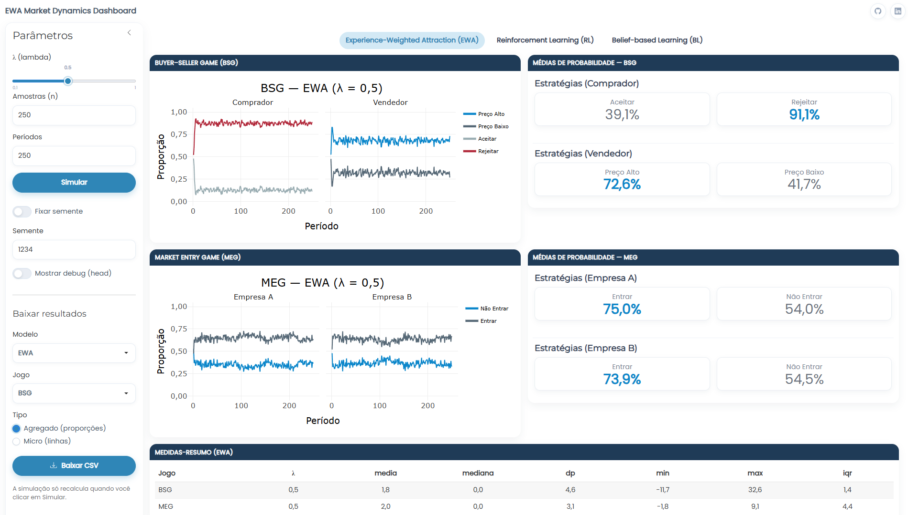

---
title: "Introdução"
---

A teoria da firma, em sua formulação tradicional, dedicou-se por muito tempo à previsão agregada de preços e quantidades, enquanto os mecanismos internos que orientam as decisões empresariais ficaram em segundo plano. Para @cyert2015behavioral, compreender o comportamento organizacional exige deslocar a análise para o interior das organizações, dado que rotinas, conflitos, expectativas e limitações cognitivas interferem na tomada de decisão e ajudam a explicar como as firmas definem suas ações. Com a mudança de enfoque, pesquisas como a de @dong2021firms passaram a tratar a formação das decisões empresariais pela interação entre fatores internos e externos, em aproximação com perspectivas evolucionárias, cognitivas e econômicas.

Nesse contexto, a decisão de entrada em mercados competitivos pode ser entendida como uma expressão concreta dos processos internos de tomada de decisão das firmas. No experimento sobre entrada excessiva, @camerer1999overconfidence mostram que os agentes entram com maior frequência quando acreditam que o resultado depende de sua própria habilidade, e não de sorte. A decisão passa a incorporar uma expectativa subjetiva sobre a posição do agente no mercado, já que os participantes tendem a considerar sua própria capacidade e a subestimar a competitividade dos demais entrantes. Quando essa expectativa é otimista demais, o número de entrantes aumenta, a disputa se torna mais intensa e, com isso, os retornos médios caem. A literatura sobre jogos de entrada situa a entrada em mercado como uma decisão atravessada por expectativa de retorno, percepção concorrencial e avaliação da posição estratégica dos agentes.

Essa mesma preocupação com a formação interna das decisões também aparece nas interações entre compradores e vendedores. Nesses casos, a incerteza envolve a forma como preços, valores e incentivos são percebidos pelos agentes durante a transação. Como argumenta @woodford2020modeling, os agentes econômicos formam percepções ruidosas sobre o ambiente, de modo que suas decisões passam por interpretações internas sujeitas a variação e erro. Mesmo com informação simétrica, a representação mental do valor atribuído ao bem, do preço considerado aceitável e do retorno esperado da transação pode permanecer imprecisa. O comportamento estratégico assume, à vista disso, caráter probabilístico, dado que as escolhas respondem tanto aos incentivos objetivos do mercado quanto às oscilações na forma como esses incentivos são percebidos.

A experimentação econômica é indispensável quando as soluções de mercado e suas interdependências não podem ser facilmente deduzidas pelos princípios teóricos, como aponta @rosenberg1994exploring, ao mostrar que o aprendizado acontece de forma prática, diretamente na interação com o mercado, e se destaca por sua forte ligação com a realidade econômica. A trajetória evolutiva delineada nesse contexto surge das primeiras tentativas na modelagem de agentes nos mercados financeiros, uma iniciativa pioneira realizada no campo das finanças comportamentais [@chakraborti2011econophysics]. Nessa abordagem, a compreensão do comportamento de escolha humana revela-se como um elemento fundamental em diversas disciplinas, principalmente em Economia, Psicologia, Inteligência Artificial e Análise de Decisão com Múltiplos Critérios [@korhonen2021rational].

A inclusão de aspectos comportamentais em modelos de simulação ganhou destaque com o avanço da Modelagem Baseada em Agentes (*Agent-Based Modeling* – ABM), um método computacional voltado para entender sistemas complexos por meio da simulação das ações e interações de agentes autônomos. Diferentemente das abordagens tradicionais de otimização na teoria dos oligopólios, os modelos baseados em agentes focam no aprendizado limitado dos agentes ao explicar como eles processam informações e tomam decisões [@kimbrough2013]. Os agentes presentes nesses modelos são representações simplificadas de indivíduos do mundo real, podendo atuar como consumidores, empresários ou até mesmo como partes de grupos maiores, como corporações ou autoridades monetárias [@isaac2008simulating].

A ABM enfatiza principalmente a heterogeneidade dos indivíduos, admitindo que diferentes agentes podem exibir comportamentos distintos, o que contradiz a premissa do *homo economicus*, que pressupõe um agente econômico completamente racional. Esse enfoque está diretamente ligado ao conceito de racionalidade limitada, proposto por @simon1991rationality, que argumenta que as decisões humanas são inevitavelmente influenciadas por limitações cognitivas e restrições de informação.

No estudo da aprendizagem estratégica em Teoria dos Jogos, o modelo de Atração Ponderada pela Experiência (*Experience-Weighted Attraction* — EWA) ocupa uma posição relevante por incorporar mecanismos cognitivos como depreciação da memória, avaliação contrafactual e perda de peso das experiências passadas. Sua aplicação em economia permite representar o aprendizado como um processo dinâmico, no qual os agentes atualizam suas escolhas a partir dos resultados efetivamente obtidos e também de estratégias que poderiam ter sido escolhidas. Para @chen2017heterogeneity, essa capacidade de combinar reforço de resultados reais e simulação de alternativas não observadas torna o EWA uma ferramenta importante para analisar o comportamento econômico em contextos estratégicos.

A Teoria dos Jogos, por sua vez, leva em consideração as situações estratégicas em que os jogadores tomam decisões em conjunto com outros indivíduos. O resultado para cada jogador é expresso quantitativamente em forma de *payoff*, seja em moeda ou utilidade. Este conceito desempenha um papel fundamental na explicação da estrutura analítica utilizada para compreender e modelar interações estratégicas, em que as escolhas de um participante individual têm um impacto direto no resultado coletivo [@fiani2006teoria].

Este estudo tem como objetivo analisar o processo de aprendizado no contexto da Teoria dos Jogos, com foco nos jogos *Buyer-Seller Game* (BSG) e *Market Entry Game* (MEG), que envolvem situações de incerteza de mercado. A simulação dos aspectos comportamentais dos jogadores é fundamental nesses cenários, especialmente por meio de algoritmos de aprendizagem. Entre os modelos mais utilizados para representar o comportamento dos agentes, destacam-se os algoritmos de Atração Ponderada pela Experiência (*Experience-Weighted Attraction* – EWA), que incluem dois enfoques principais: o Modelo de Aprendizado por Reforço (*Reinforcement Learning* – RL) e o Modelo de Aprendizado Baseado em Crenças (*Belief-based Learning* – BL). O estudo também busca comparar o desempenho desses modelos, com o objetivo de compreender suas implicações sobre os equilíbrios teóricos de Nash, tanto em estratégias puras quanto em mistas, dentro dos jogos matriciais.

Dessa forma, propõe-se a implementação do modelo desenvolvido por @camerer1998probability para analisar o comportamento dos agentes na tomada de decisões estratégicas e os equilíbrios nas matrizes BSG e MEG, buscando solucionar o seguinte problema de pesquisa: como se desdobram as dinâmicas de cooperação ou concorrência entre agentes em cenários de incerteza, e de que forma ocorre o aprendizado quando se aplicam diferentes modelos comportamentais da Teoria dos Jogos?

## Justificativa

A adoção de uma perspectiva de Modelagem Baseada em Agentes decorre do caráter computacional da pesquisa, que permite representar jogadores individuais em interação estratégica e acompanhar a atualização de suas escolhas ao longo do tempo. A abordagem amplia as possibilidades empíricas da economia ao flexibilizar pressupostos rígidos de modelos matemáticos tradicionais, muitas vezes dependentes de soluções analíticas [@axtell2022agent]. Como apontam @ceschi2014, uma limitação dos modelos descritivos convencionais está na dificuldade de captar mudanças de comportamento ao longo das interações. A simulação baseada em agentes permite incorporar essa mudança ao próprio funcionamento do modelo, uma vez que as decisões deixam de ser tratadas como fixas e passam a se ajustar conforme os agentes acumulam experiência, respondem aos resultados obtidos e revisam suas estratégias diante dos demais participantes. Nos modelos econômicos clássicos, como a Teoria dos Jogos em sua forma normal, a capacidade de aprendizagem e adaptação dos jogadores não são bem representadas, visto que esses modelos são essencialmente estáticos e focam apenas em análises instantâneas sem considerar a dinâmica temporal.

Ao incorporar o conceito de racionalidade limitada, os modelos baseados em agentes refletem decisões com base em informações incompletas ou em heurísticas simplificadas, desafiando a premissa neoclássica de que indivíduos têm acesso e capacidade de processar todas as informações para maximizar sua utilidade. Esta noção de racionalidade limitada admite que os agentes não podem avaliar todas as opções ou antecipar todas as possíveis consequências de suas escolhas, o que, por sua vez, oferece uma representação mais realista das limitações cognitivas humanas e da complexidade dos sistemas econômicos. Daniel Kahneman e Amos Tversky aprofundaram esse entendimento ao desenvolver uma taxonomia de erros de racionalidade, como representatividade, disponibilidade e ancoragem, que explicam as distorções cognitivas observadas nas decisões econômicas [@enrico2021].

Os algoritmos de aprendizagem ajudam a simular comportamentos realistas, o que garante a superação das restrições impostas pela suposição de racionalidade perfeita. Em vez de aderirem a regras imutáveis, os agentes ajustam suas estratégias com base em experiências passadas e informações disponíveis para maximizar sua utilidade ao longo do tempo. Esses algoritmos consideram ainda distorções cognitivas, como a tendência de valorizar excessivamente eventos recentes ou a aversão a perdas, tornando a modelagem comportamental mais alinhada com o que é observado empiricamente. Entre os modelos mais relevantes na literatura sobre algoritmos de aprendizagem adaptativa, destacam-se o *Experience-Weighted Attraction* e seus casos especiais, o *Reinforcement Learning* e o *Belief-based Learning*, conhecidos por seu excelente ajuste a dados experimentais, tanto em nível agregado quanto individual, em jogos matriciais [@koster2019].

Este trabalho também investiga conceitos da Teoria dos Jogos, uma área vital nos estudos econômicos e matemáticos, que desempenha um imprescindível papel na evolução da análise da economia moderna. Foram analisados os jogos BSG e MEG, escolhidos por sua importância na compreensão de interações estratégicas e dinâmicas de mercado. A Figura @fig-ch1-1 exemplifica as capacidades computacionais na Teoria dos Jogos, incluindo jogos matriciais e modelos de aprendizado estratégico.

A ABM é aplicada através de jogos matriciais que expõem equilíbrios e conflitos nas decisões estratégicas. Este método empírico baseia-se na implementação dos modelos EWA, RL e BL, os quais estabelecem a edificação do comportamento estratégico, da racionalidade e, sobretudo, do aprendizado. Funcionando em conjunto com a Teoria dos Jogos, esses modelos ampliam a capacidade de análise comportamental dos jogadores, através de uma visão mais detalhada e realista.

```{r}
#| label: fig-ch1-1
#| fig-cap: "Composição dos pilares de estudo"
#| fig-align: center
#| out-width: "70%"
#| fig-cap-location: top


```

<p class="quarto-figure-attribution">Fonte: Elaborado pelo autor (2026).</p>

O método ABM pode oferecer uma compreensão mais extensa das propriedades de interação emergentes em circunstâncias complexas. Destaca-se, nesse contexto, a integração de modelos de interação de indivíduos e organizações heterogêneas na produção industrial, imóveis, gastos governamentais e investimentos empresariais, ou seja, áreas onde a intuição humana pode falhar [@farmer2009economy].

## Objetivo geral

O presente estudo tem como objetivo analisar o processo de aprendizagem em contextos de incerteza, explorando modelos de simulação para comparar o desempenho e o comportamento dos agentes em relação aos equilíbrios teóricos identificados nos jogos *Buyer-Seller Game* e *Market Entry Game*.

## Objetivos específicos

- Implementar um modelo baseado em agentes utilizando simulação computacional, incorporando os algoritmos de aprendizagem *Experience-Weighted Attraction*, *Reinforcement Learning* e *Belief-based Learning*.
- Examinar a interação entre os agentes para identificar padrões comportamentais relacionados à tomada de decisões em cada modelo de aprendizagem.
- Comparar o desempenho, seja ele cooperativo ou concorrencial, de cada algoritmo de aprendizagem, com o intuito de identificar qual deles alcançou os melhores resultados.

## Estrutura do trabalho

Este estudo está organizado em seis capítulos, conforme descrito a seguir:

- **Capítulo 1 — Introdução:** apresenta o contexto da pesquisa, a justificativa, os objetivos e a estrutura do trabalho, destacando a relevância das dinâmicas de aprendizado em cenários de incerteza de mercado. Também situa a aplicação dos modelos EWA, RL e BL em jogos matriciais e apresenta os recursos de replicação desenvolvidos, como o *web app* interativo e o repositório do projeto.

- **Capítulo 2 — Referencial Teórico:** discute a análise empírica em Teoria dos Jogos e sua articulação com a Modelagem Baseada em Agentes, com destaque para o papel da aprendizagem adaptativa na representação de decisões estratégicas. O capítulo aborda a racionalidade limitada, a atualização das atrações no modelo EWA, seus casos especiais RL e BL, a distinção entre equilíbrio teórico e trajetória de aprendizagem, além de estudos que aplicam esses modelos em contextos experimentais e econômicos. Também apresenta um levantamento bibliográfico sobre o uso do EWA e situa a lacuna explorada por este trabalho nos jogos BSG e MEG.

- **Capítulo 3 — Procedimentos Metodológicos:** apresenta a abordagem quantitativa adotada, baseada em simulação computacional. São descritas as formulações dos modelos EWA, RL e BL, o papel dos parâmetros de aprendizagem, o critério de estabilidade das proporções estratégicas e o uso do teste de Kolmogorov-Smirnov para comparação distributiva das probabilidades de escolha.

- **Capítulo 4 — Aplicação do Modelo de Simulação:** descreve a configuração dos jogos *Buyer-Seller Game* e *Market Entry Game*, incluindo as matrizes de estratégias, os *payoffs* e os equilíbrios teóricos utilizados como referência. Também apresenta a implementação computacional dos algoritmos em R, com apoio do pacote *Rgamer*, e o processo de geração dos dados simulados.

- **Capítulo 5 — Resultados:** analisa os resultados das simulações a partir das trajetórias de escolha, da estabilidade do aprendizado, das medidas-resumo das atrações, das probabilidades médias de escolha e da estrutura distributiva das probabilidades. O capítulo também examina a aderência dos modelos ao equilíbrio teórico, por meio da comparação entre os padrões gerados por EWA, RL e BL nos jogos BSG e MEG.

- **Capítulo 6 — Considerações Finais:** retoma os principais achados da pesquisa, avaliando como os modelos de aprendizagem capturam diferentes formas de adaptação estratégica. Também apresenta as contribuições do estudo, suas limitações e possíveis extensões, com ressalto para a estimação de parâmetros com dados experimentais e a aplicação em jogos com mais agentes.

Além da modelagem teórica e das simulações descritas neste trabalho, foi desenvolvido um *web app* interativo^[Disponível em: <https://drewmelo.shinyapps.io/ewa-market-dynamics/>. Acesso em: 19 fev. 2026.], presente na Figura @fig-ch1-2, que reproduz integralmente os resultados apresentados ao longo do estudo, incluindo as proporções de escolha das estratégias, medidas-resumo e gráficos de dinâmica ao longo dos períodos. A aplicação permite ao usuário selecionar livremente os valores dos parâmetros, como $\lambda$, número de amostras e quantidade de períodos, de forma a possibilitar a exploração de diferentes cenários sem a necessidade de conhecimento em linguagem de programação. A cada simulação realizada, o sistema gera automaticamente um novo relatório com estatísticas descritivas e visualizações correspondentes, o que fortalece a transparência e a replicabilidade da pesquisa.

```{r}
#| label: fig-ch1-2
#| fig-cap: "Aplicação web para replicação das simulações dos modelos de aprendizado"
#| fig-align: center
#| out-width: "90%"
#| fig-cap-location: top


```

<p class="quarto-figure-attribution">Fonte: Elaborado pelo autor (2026).</p>

Para usuários com familiaridade em programação, todo o código do projeto também está disponível no GitHub^[Repositório disponível em: <https://github.com/drewmelo/EWA-MarketDynamics>. Acesso em: 14 dez. 2024.], estruturado com controle de dependências via *renv* e pipeline automatizado com *targets*. Essa organização possibilita a recriação do mesmo ambiente computacional do estudo, inclusive em versões mais recentes do R, além de assegurar acesso completo à estrutura do modelo e ampliar as possibilidades de extensão e validação dos resultados.
