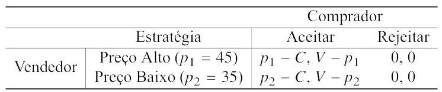
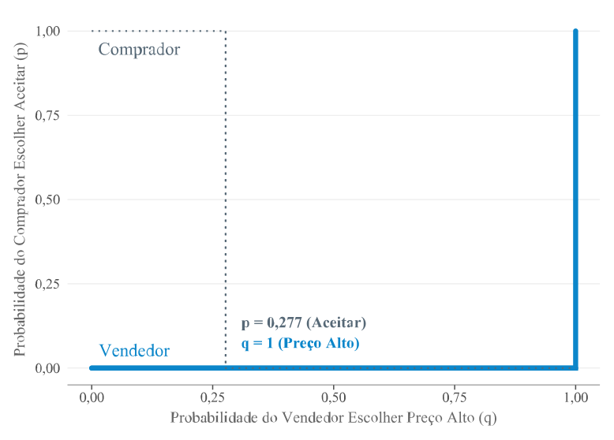
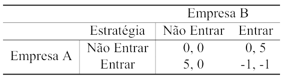
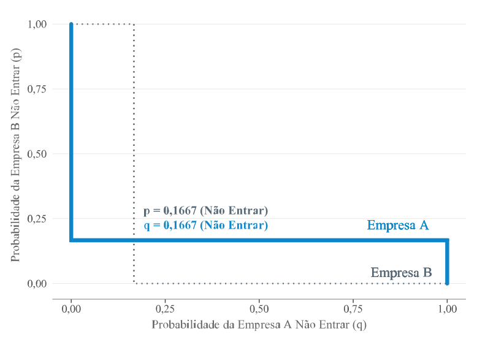
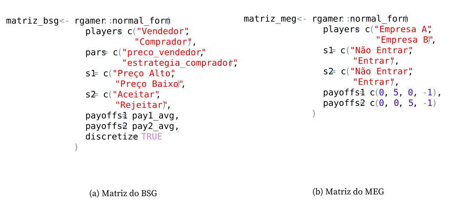
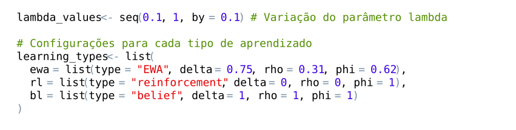

A aplicação dos modelos de aprendizagem foi realizada a partir de dois jogos matriciais: o *Buyer-Seller Game* e o *Market Entry Game*. A escolha desses jogos se justifica pela capacidade de representar situações econômicas de decisão simultânea sob incerteza estratégica, ainda que cada um organize essa incerteza de modo distinto. No BSG, a interação entre vendedor e comprador permite analisar decisões de preço e aceitação da oferta em um ambiente de incerteza simétrica estocástica, no qual a valoração do bem varia por choques exógenos. O MEG, por sua vez, desloca a análise para a decisão de entrada em mercado, em que o retorno de cada empresa depende diretamente da escolha realizada pela concorrente.

Os dois jogos, portanto, oferecem estruturas complementares para a simulação. O BSG concentra a atenção na negociação bilateral sob flutuações de mercado. O MEG enfatiza a interdependência entre firmas diante do risco de entrada simultânea. A comparação entre esses cenários permite observar como EWA, RL e BL ajustam escolhas, atrações e probabilidades quando submetidos a diferentes formas de incerteza e coordenação estratégica.

A subseção @sec-configuracao-jogos descreve a estrutura das matrizes de estratégias e *payoffs* dos jogos BSG e MEG, explorando também os equilíbrios alcançados em estratégias puras e mistas. A subseção @sec-implementacao-computacional apresenta a execução dos algoritmos EWA, RL e BL na linguagem de programação R, com foco na variação do parâmetro $\lambda$.

## Configuração dos jogos matriciais {#sec-configuracao-jogos}

O BSG representa a dinâmica de negociação entre compradores e vendedores, e em como os agentes ajustam suas estratégias conforme as interações no mercado. Nesse jogo, o vendedor define o preço de venda e o comprador decide se aceita ou rejeita a oferta. O vendedor pode escolher entre um preço alto, $p_1 = 45$, ou um preço baixo, $p_2 = 35$, e o comprador pode adotar a estratégia $s_2$, que corresponde à decisão de aceitar ou recusar a proposta. Considerando um custo fixo de produção de $C = 25$, o *payoff* do vendedor, representado por $\pi_1$, é apresentado na Equação @eq-payoff-vendedor-bsg.

```{r}
#| label: code-payoffs1
#| echo: true 
#| eval: false
#| code-fold: true 
#| code-summary: "Mostrar código: payoff do vendedor"

func_payoff1 <- function(preco_vendedor, estrategia_comprador) {
  payoff <- 0
  if (estrategia_comprador == "Aceitar") {
    if (preco_vendedor == 45 || preco_vendedor == "Preço Alto")      
      p <- 45
    else if (preco_vendedor == 35 || preco_vendedor == "Preço Baixo") 
      p <- 35
    else p <- 0
    payoff <- p - c
  }
  payoff
}
```

$$
\pi_1(p_i, s_2) =
	\begin{cases} 
		p_i - C \text{,} & \text{se } s_2 = a \\
		0 \text{,} & \text{se } s_2 = r
	\end{cases}
$$ {#eq-payoff-vendedor-bsg}

em que 

- $p_i$ é o preço escolhido pelo vendedor, podendo ser $p_1 = 45$ ou $p_2 = 35$;
- $s_2$ representa a estratégia escolhida pelo comprador.

A função de *payoff* do comprador, representada por $\pi_2$ na Equação @eq-payoff-comprador-bsg, depende de $V$, isto é, da valoração atribuída ao bem. No modelo, esse valor é sorteado a partir de uma distribuição uniforme contínua no intervalo $[C + \epsilon, 45]$, de modo que $V \sim U(C + \epsilon, 45)$, com o termo de ruído exógeno $\epsilon$ variando entre 1 e 10. A formulação do BSG segue uma lógica próxima à de @kasbekar2010pricing, que analisam a formação de preços sob incerteza simétrica estocástica. Nos dois casos, a incerteza é exógena e compartilhada entre os agentes, uma vez que decorre de um valor de mercado distribuído em um intervalo conhecido.

No presente modelo, $V$ é realizado e observado a cada rodada. O termo $\epsilon$ introduz flutuações na valoração do bem, associadas a variações de demanda, preços, inflação, choques de renda ou outros eventos externos ao ambiente de decisão dos jogadores. Como essas variações são observáveis para ambos os agentes, o ruído altera o valor do bem sem produzir assimetria de informação. A incerteza opera, nesse cenário, como perturbação externa comum ao comprador e ao vendedor. Tal simplificação aproxima o BSG de um ambiente com incerteza observável e preserva a coerência com @kasbekar2010pricing, ao mesmo tempo que torna a estrutura operacional para a simulação adaptativa em uma matriz $2 \times 2$.

```{r}
#| label: code-payoffs2
#| echo: true 
#| eval: false
#| code-fold: true 
#| code-summary: "Mostrar código: payoff do comprador"

func_payoff2 <- function(preco_vendedor, estrategia_comprador) {
  v_min <- c + base::sample(1:10, 1)
  v_max <- 45
  v <- stats::runif(1, min = v_min, max = v_max)
  payoff <- 0
  if (estrategia_comprador == "Aceitar") {
    if (preco_vendedor == 45 || preco_vendedor == "Preço Alto")     
       p <- 45
    else if (preco_vendedor == 35 || preco_vendedor == "Preço Baixo") 
       p <- 35
    else p <- 0
    payoff <- base::round(v - p, 2)
  }
  payoff
}
```


$$
\pi_2(p_i, s_2) =
	\begin{cases} 
		V - p_i \text{,} & \text{se } s_2 = a \\
		0 \text{,} & \text{se } s_2 = r
	\end{cases}
$$ {#eq-payoff-comprador-bsg}

A aplicação do método de Monte Carlo permite estimar os *payoffs* esperados sob a estrutura estocástica adotada no BSG. Como $V$ varia por choques exógenos, a amostragem numérica torna possível incorporar essa variação diretamente no cálculo dos ganhos do comprador e do vendedor. A matriz de *payoffs* foi obtida a partir de 100.000 repetições, com sorteios aleatórios de $V$ no intervalo $[C + \epsilon, 45]$. Em cada repetição, os ganhos associados às combinações estratégicas foram calculados e, ao final, agregados por médias esperadas. O processo segue o respaldo teórico de @schjaer2004modeling, ao demonstrar que as simulações Monte Carlo produzem resultados praticamente idênticos aos cálculos estocásticos teóricos quanto ao valor esperado e à variância. No presente modelo, a amostragem numérica cumpre justamente essa função ao transformar a incerteza econômica representada por $V$ em uma matriz operacional de *payoffs*, preservando a variação dos ganhos esperados gerada pelos choques de mercado.

```{r}
#| label: code-montecarlo
#| echo: true
#| eval: false
#| code-fold: true
#| code-summary: "Mostrar código: simulação de Monte Carlo"

base::set.seed(06-08-2024)

# Simulação de Monte Carlo para as quatro combinações estratégicas
N <- 100000

s1 <- c("Preço Alto", "Preço Baixo")   # vendedor
s2 <- c("Aceitar", "Rejeitar")         # comprador

grid <- expand.grid(
  preco_vendedor = s1,
  estrategia_comprador = s2,
  stringsAsFactors = FALSE
)

# Cálculo do payoff médio em cada combinação
mc_mean <- function(f, preco, estr, N) {
  mean(replicate(N, f(preco, estr)))
}

grid$mean1 <- mapply(
  function(p, e) mc_mean(func_payoff1, p, e, N),
  grid$preco_vendedor,
  grid$estrategia_comprador
)

grid$mean2 <- mapply(
  function(p, e) mc_mean(func_payoff2, p, e, N),
  grid$preco_vendedor,
  grid$estrategia_comprador
)
```


A Tabela @tbl-matriz-bsg apresenta o processo de decisão dos jogadores sob esse cenário de negociação com incerteza simétrica estocástica. Quando o comprador aceita o preço, o *payoff* do vendedor é calculado como a diferença entre o preço e o custo de produção, $p_i - C$, enquanto o *payoff* do comprador é a diferença entre a valoração $V$ e o preço pago, $V - p_i$. Se o comprador rejeita a oferta, ambos os *payoffs* são nulos, pois a transação não ocorre. 

É notável que, embora o jogo envolva aleatoriedade, sobretudo na percepção do comprador sobre o custo de produção, o equilíbrio em estratégias puras geralmente se alcança quando o vendedor opta pelo Preço Alto e o comprador decide Rejeitar. Para validar essa análise, realizou-se um *loop* de 100 iterações desse jogo, onde aproximadamente 75% dos resultados confirmaram o equilíbrio de Preço Alto e Rejeitar, e 25% revelaram um segundo equilíbrio possível, caracterizado por Preço Baixo e Rejeitar. Os detalhes dessas iterações, incluindo a contagem acumulada das ocorrências, são apresentados na Figura @fig-ch5-18 no Apêndice.

```{r}
#| label: code-matriz-bsg 
#| echo: true 
#| eval: false
#| code-fold: true 
#| code-summary: "Mostrar código: matriz do BSG"

# Buyer-Seller Game (BSG)
# Matriz 2x2 com payoffs médios obtidos via simulação
matriz_bsg <- rgamer::normal_form(
  players = c("Vendedor", "Comprador"),
  pars    = c("preco_vendedor", "estrategia_comprador"),
  s1      = s1,
  s2      = s2,
  payoffs1 = pay1_avg,
  payoffs2 = pay2_avg,
  discretize = TRUE
)
```

::: {#tbl-matriz-bsg}

```{r}
#| fig-align: center
#| out-width: "70%"
#| fig-cap-location: top


```

Matriz de ganhos do jogo BSG

:::

<p class="quarto-figure-attribution">
Fonte: Elaborado pelo autor (2026).
</p>

No equilíbrio de Nash em estratégias puras, o vendedor pratica Preço Alto e o comprador rejeita a oferta, o que gera *payoffs* nulos para ambos. O *Buyer-Seller Game* também pode ser formulado em estratégias mistas, caso em que as escolhas passam a ser probabilísticas e dependem das condições de indiferença entre as ações disponíveis. Na parametrização adotada, porém, o equilíbrio misto degenera. O comprador rejeita com probabilidade 1, enquanto o vendedor permanece indiferente entre praticar Preço Alto ou Preço Baixo. A probabilidade de aproximadamente 27,7% corresponde apenas ao ponto teórico de indiferença do comprador, sem alterar a solução efetiva do jogo.

A Figura @fig-ch4-1 apresenta as probabilidades associadas às estratégias mistas dos jogadores no BSG. No eixo X, é representada a probabilidade de o vendedor praticar Preço Alto, enquanto o eixo Y mostra a probabilidade de o comprador aceitar a oferta. O ponto próximo de 27,7% indica a condição teórica de indiferença do comprador em relação à aceitação da proposta. Contudo, na parametrização adotada, essa condição não gera uma randomização efetiva entre aceitar e rejeitar, pois a solução do jogo conduz à rejeição com probabilidade 1. A estrutura dos *payoffs* auxilia no entendimento desse resultado, dado que o Preço Alto reduz a atratividade da compra e torna a rejeição a resposta mais consistente para o comprador. Com isso, o jogo se estabiliza em um equilíbrio puro marcado por coordenação imperfeita, no qual a tentativa do vendedor de ampliar o retorno por meio do preço elevado acaba associada à recusa da transação.

```{r}
#| label: code-bsgnash
#| echo: true 
#| eval: false
#| code-fold: true 
#| code-summary: "Mostrar código: equilíbrio de Nash do BSG"

# Resolve o BSG
s_matriz_bsg <- rgamer::solve_nfg(matriz_bsg, mark_br = T)
```

Nesse caso, o Vendedor adota uma estratégia pura, ao passo que o Comprador utiliza uma estratégia mista, o que caracteriza um equilíbrio misto assimétrico no jogo. Segundo @john2005learning, equilíbrios mistos assimétricos ocorrem quando alguns jogadores seguem estratégias puras e outros distribuem suas escolhas entre diferentes alternativas, ou quando todos misturam suas estratégias, mas com probabilidades distintas. Em equilíbrios mistos simétricos, por outro lado, todos os jogadores distribuem suas escolhas entre as mesmas estratégias e com as mesmas probabilidades, de modo que o padrão estratégico entre eles se torna equivalente.
```{r}
#| label: fig-ch4-1
#| fig-cap: "Equilíbrio das probabilidades associadas às estratégias mistas dos jogadores no jogo BSG"
#| fig-align: center
#| out-width: "90%"
#| fig-cap-location: top


```

<p class="quarto-figure-attribution">Fonte: Elaborado pelo autor (2026).</p>

O *Market Entry Game* é amplamente utilizado na Teoria dos Jogos para analisar o comportamento estratégico em mercados oligopolistas. Assim como o BSG, trata-se de um jogo de informação perfeita, no qual as empresas conhecem todas as estratégias e *payoffs* disponíveis. A diferença central está na natureza competitiva, enquanto o BSG representa decisões bilaterais de troca sujeitas a choques exógenos e flutuações aleatórias de mercado, o MEG captura a interação estratégica entre firmas que decidem entrar ou não em um mercado, de forma a equilibrar as oportunidades de lucro com os riscos decorrentes da competição direta, como mostrado na Tabela @tbl-matriz-meg.

Na análise da matriz, se ambas as empresas optam por não entrar no mercado, seus *payoffs* são zero (0, 0). Se apenas uma empresa entrar no mercado, ela captura todo o mercado, resultando em ganhos de (5, 0) para a Empresa A ou (0, 5) para a Empresa B. No entanto, se ambas as empresas entrarem no mercado, a competição intensa leva a perdas para ambas, com *payoffs* de (-1, -1).

Os equilíbrios de Nash em estratégias puras para este jogo ocorrem em dois cenários opostos. No primeiro, a Empresa A decide entrar no mercado, enquanto a Empresa B opta por não entrar. No segundo, é a Empresa B que entra no mercado, enquanto a Empresa A decide não participar. Se uma empresa que inicialmente decidiu não entrar no mercado resolvesse mudar de ideia e competir, enfrentaria concorrência direta, o que resultaria em um *payoff* negativo. Destarte, tanto a configuração (Entrar, Não Entrar) quanto (Não Entrar, Entrar) representam equilíbrios de Nash, uma vez que, nessas situações, as empresas maximizam seus resultados e não têm incentivo para alterar suas estratégias, dado o comportamento da outra.

```{r}
#| label: code-matriz-meg 
#| echo: true 
#| eval: false
#| code-fold: true 
#| code-summary: "Mostrar código: matriz do MEG"

# Market Entry Game (MEG)
# Jogo de entrada estratégica entre duas empresas
matriz_meg <- rgamer::normal_form(
  players = c("Empresa A", "Empresa B"),
  s1 = c("Não Entrar", "Entrar"),
  s2 = c("Não Entrar", "Entrar"),
  payoffs1 = c(0, 5, 0, -1),
  payoffs2 = c(0, 0, 5, -1)
)
```

::: {#tbl-matriz-meg}

```{r}
#| fig-align: center
#| out-width: "60%"
#| fig-cap-location: top


```

Matriz de ganhos do jogo MEG

:::

<p class="quarto-figure-attribution">
Fonte: Elaborado pelo autor (2026).
</p>

A Figura @fig-ch4-2 mostra as probabilidades de as empresas não entrarem no mercado. No eixo X, é mostrada a probabilidade de a Empresa A não entrar, enquanto o eixo Y exibe a probabilidade de a Empresa B não entrar. O ponto onde as linhas de melhores respostas se cruzam indica o equilíbrio de Nash em estratégias mistas, ou seja, quando a probabilidade de ambas as empresas não entrarem no mercado é de aproximadamente 16,67% ($p =$ 0,1667). Em contrapartida, tanto a Empresa A quanto a Empresa B escolhem entrar no mercado com uma probabilidade de 83,33% ($1 - p =  0,8333$). Esse equilíbrio, ao contrário do primeiro jogo, configura-se como simétrico, pois ambas as empresas estão randomizando suas estratégias com probabilidades iguais, ajustando-se às incertezas relacionadas às decisões da concorrente.

```{r}
#| label: code-megnash
#| echo: true 
#| eval: false
#| code-fold: true 
#| code-summary: "Mostrar código: equilíbrio de Nash do MEG"

# Resolve o MEG
s_matriz_meg <- rgamer::solve_nfg(matriz_meg, mark_br = T)
```

```{r}
#| label: fig-ch4-2
#| fig-cap: "Equilíbrio das probabilidades associadas às estratégias mistas dos jogadores no jogo MEG"
#| fig-align: center
#| out-width: "90%"
#| fig-cap-location: top


```

<p class="quarto-figure-attribution">Fonte: Elaborado pelo autor (2026).</p>

A Figura @fig-ch4-3 ilustra o processo de criação das matrizes, subdivididas nas Figuras (a) e (b), que representam os modelos BSG e MEG, respectivamente. Nos parâmetros da função *normal form* do pacote *Rgamer*, especificam-se os jogadores em *players*, as estratégias dos jogadores 1 e 2 em *s1* e *s2*, e os respectivos ganhos em *payoffs1* e *payoffs2*. 

```{r}
#| label: fig-ch4-3
#| fig-cap: "Rotina de programação das matrizes BSG e MEG"
#| fig-align: center
#| out-width: "90%"
#| fig-cap-location: top


```

<p class="quarto-figure-attribution">Fonte: Elaborado pelo autor (2026).</p>

Na Figura @fig-ch4-3, os *payoffs* de ambos os jogadores são definidos por funções que calculam os retornos para cada combinação de estratégias, com base em parâmetros definidos em *pars*, como o preço e a aceitação ou rejeição da oferta, conforme mencionado nas Equações @eq-payoff-vendedor-bsg e @eq-payoff-comprador-bsg. A discretização, por meio do parâmetro *discretize*, assegura que as funções de *payoff* sejam avaliadas precisamente para as combinações de estratégias especificadas.


## Implementação computacional {#sec-implementacao-computacional}

A implementação dos algoritmos de aprendizado EWA, RL e BL foi realizada utilizando a função *sim learning*, com os parâmetros configurados conforme ilustrado na Figura @fig-ch4-4. Os intervalos utilizados para $\phi$ e $\delta$ foram baseados no estudo de @JOSEPHSON20081569, que empregou o modelo EWA em jogos de matriz $2 \times 2$ e adotou o método de máxima verossimilhança para estimar os parâmetros, ajustando os valores de $\phi$ e $\delta$ para minimizar a discrepância entre as previsões do modelo e os comportamentos observados. Os intervalos estimados foram de 0,5 a 0,75 para $\phi$, e de 0,5 a 1 para $\delta$. A abordagem permitiu identificar esses intervalos como os que melhor representavam o aprendizado em jogos $2 \times 2$.

```{r}
#| label: fig-ch4-4
#| fig-cap: "Configuração dos algoritmos de aprendizagem"
#| fig-align: center
#| out-width: "90%"
#| fig-cap-location: top


```

<p class="quarto-figure-attribution">Fonte: Elaborado pelo autor (2026).</p>

Os parâmetros do modelo EWA foram definidos com base nos intervalos reportados na literatura e ajustados por médias. O parâmetro $\phi$, associado à influência das atrações acumuladas no aprendizado, foi fixado em aproximadamente 0,62, valor correspondente à média do intervalo entre 0,5 e 0,75. O parâmetro $\delta$, responsável pela incorporação dos *payoffs* de estratégias não escolhidas, foi definido em 0,75, média do intervalo entre 0,5 e 1. Para $\rho$, que regula a depreciação da experiência acumulada ao longo do tempo, adotou-se a restrição $\rho \le \phi$, conforme descrito por @camerer1999experience. A partir dessa restrição, $\rho$ foi fixado em 0,31, valor correspondente à média entre o limite inferior, igual a 0, e o valor atribuído a $\phi$. A parametrização adotada representa uma escolha intermediária dentro dos valores observados na literatura.

No modelo de aprendizado por reforço, ao considerar que  $\delta = \rho = 0$, os jogadores tomam decisões com base apenas no pagamento mais recente que receberam, sem levar em conta alternativas que poderiam ter escolhido. De acordo com a documentação do pacote *Rgamer*, a parametrização $\phi = 1$ no contexto de aprendizado por reforço implica que as atrações são determinadas pelos reforços anteriores, mas sem a acumulação de experiência ao longo do tempo, o que representa uma variante que preserva o histórico de atrações passadas sem incorporar novas experiências de maneira acumulativa.

Ao modificar o parâmetro $\delta$ para 1, os jogadores passam a atribuir o mesmo peso aos *payoffs* das estratégias escolhidas e não escolhidas no processo de atualização. A aprendizagem deixa, assim, de depender apenas do reforço obtido pela ação efetivamente realizada e passa a incorporar também os ganhos hipotéticos das alternativas disponíveis. Com $\rho = 1$, o histórico acumulado é preservado integralmente, aproximando o processo do *fictitious play*, no qual as estratégias são ajustadas a partir das frequências empíricas observadas nas jogadas anteriores. Essa configuração se apoia em @camerer1999experience, que apontam melhor ajuste do aprendizado baseado em crenças no EWA quando $\rho = 1$. Os autores também observam que, nesse caso especial, $\phi$ tende a assumir o mesmo valor de $\rho$. Por isso, $\phi$ foi definido como 1, preservando a coerência entre os parâmetros de memória e atualização das atrações. A parametrização resultante descreve um aprendizado baseado no histórico completo das interações, no qual experiências passadas, frequências observadas e *payoffs* hipotéticos continuam a influenciar as escolhas ao longo do tempo.

Neste estudo, $\lambda$ varia de 0,1 a 1, em incrementos de 0,1, para avaliar como diferentes níveis de sensibilidade às atrações afetam a aprendizagem estratégica. A variação é aplicada ao modelo EWA completo e aos seus casos especiais, permitindo comparar o comportamento de EWA, RL e BL sob a mesma escala paramétrica. A escolha desse intervalo acompanha, de acordo com a literatura, a interpretação usual do parâmetro: valores mais baixos tornam as escolhas mais dispersas e próximas de um comportamento aleatório, enquanto valores mais altos aumentam a concentração nas estratégias com maiores atrações. A função *sim learning*, utilizada nas simulações, também exige valores positivos para $\lambda$, o que delimita a faixa adotada. Com essa configuração, torna-se possível observar como a intensidade de resposta às atrações modifica o aprendizado em jogos matriciais $2 \times 2$.

O procedimento parte da criação de um vetor com valores de $\lambda$ entre 0,1 e 1, em incrementos de 0,1. Para cada valor, o *script* executa uma simulação sobre a matriz do jogo, mantendo constantes os demais parâmetros definidos anteriormente. A função *sim learning* calcula os resultados de acordo com o número de amostras, os períodos simulados e o modelo de aprendizagem selecionado. Os resultados de cada execução são armazenados em uma lista, o qual permite recuperar, comparar e organizar posteriormente as trajetórias geradas para cada nível de sensibilidade às atrações.

A Lei dos Grandes Números estabelece que, com o aumento das repetições de um experimento, a média observada tende a se aproximar do valor esperado. Em simulações computacionais, esse princípio ajuda a reduzir a influência de oscilações pontuais e torna os resultados menos dependentes de realizações específicas do processo aleatório.

Com base nessa lógica, foram definidos 500 *samples* e 500 *periods* para cada simulação. A escolha busca produzir trajetórias suficientemente estáveis para representar o comportamento teórico dos modelos, sem elevar desnecessariamente o custo computacional. Valores muito baixos poderiam deixar os resultados excessivamente sensíveis à aleatoriedade das rodadas. Valores muito altos, por outro lado, aumentariam o volume de dados gerados e o tempo de processamento, sem ganho proporcional para os objetivos da análise. A parametrização adotada procura, por conseguinte, equilibrar representatividade estatística e viabilidade operacional.

```{r}
#| label: code-simulacao
#| echo: true 
#| eval: false
#| code-fold: true 
#| code-summary: "Mostrar código: simulações dos modelos"

# Fixa a semente para garantir reprodutibilidade.
base::set.seed(07-02-2025)

# Simulação da matriz 1 - BSG
results_bsg <- sim_lambda(
  matriz = matriz_bsg,
  game_label = "BSG",
  learning_types = learning_types,
  lambda_values = lambda_values,
  n_samples = 500,
  n_periods = 500
)

# Simulação da matriz 2 - MEG
results_meg <- sim_lambda(
  matriz = matriz_meg,
  game_label = "MEG",
  learning_types = learning_types,
  lambda_values = lambda_values,
  n_samples = 500,
  n_periods = 500
)
```