---
title: "Resultados"
---

Esta seção reúne os resultados das simulações dos jogos BSG e MEG a partir de três eixos de análise: descritivo, exploratório e inferencial. A análise descritiva organiza as trajetórias de escolha, as taxas de estabilidade e as medidas-resumo das atrações e probabilidades geradas pelos modelos EWA, RL e BL. A exploração dos dados aparece nas comparações visuais das distribuições, nos histogramas, nas distribuições acumuladas empíricas, nos padrões de dispersão entre jogos, papéis estratégicos e valores de $\lambda$, além da distância média ao alvo teórico, utilizada para avaliar a aderência das simulações às probabilidades de referência. A parte inferencial entra de forma complementar, com o teste de Kolmogorov-Smirnov e os resíduos padronizados do teste $\chi^2$.

A exposição está organizada em quatro blocos. A subseção 5.1 examina as trajetórias de escolha e a estabilidade do aprendizado. A subseção 5.2 trata das medidas-resumo das atrações e das probabilidades de escolha. A subseção 5.3 discute a estrutura distributiva das probabilidades e a distância KS entre modelos ao longo das variações de $\lambda$. A subseção 5.4 avalia a aderência das simulações ao equilíbrio teórico. A divisão organiza dimensões que se relacionam entre si, mas não medem o mesmo aspecto do aprendizado, como a estabilidade do processo, a dispersão das escolhas, a diferença distributiva entre modelos e a proximidade substantiva em relação ao equilíbrio.

## Trajetórias de escolha e estabilidade do aprendizado {#sec-trajetorias-estabilidade}

Para a construção das Figuras @fig-ch5-1 a @fig-ch5-5, foram calculadas, em cada período, as proporções médias de escolha de cada estratégia para cada jogador nos jogos BSG e MEG, a partir da frequência relativa observada nas simulações. Em termos práticos, considerou-se, para cada combinação de modelo, jogador e período, quantas vezes determinada estratégia foi efetivamente escolhida em relação ao total de decisões naquele recorte. As curvas, portanto, representam a evolução dessas frequências ao longo do tempo. A análise concentrou-se nos valores $\lambda = 0{,}1$, $\lambda = 0{,}3$, $\lambda = 0{,}5$, $\lambda = 0{,}8$ e $\lambda = 1$, selecionados por cobrirem diferentes níveis de sensibilidade às atrações, desde um ajuste mais gradual e disperso até respostas mais intensas e concentradas em determinadas estratégias. A seleção desses casos permite observar a mudança na dinâmica de aprendizado sem sobrecarregar a exposição principal com todas as variações simuladas. As demais configurações do parâmetro, correspondentes a $\lambda = 0{,}2$, $\lambda = 0{,}4$, $\lambda = 0{,}6$, $\lambda = 0{,}7$ e $\lambda = 0{,}9$, encontram-se reunidas no Apêndice, nas Figuras @fig-ap-20 a @fig-ap-24.

```{r}
#| label: code-preparacao-trajetorias
#| echo: true 
#| eval: false
#| code-fold: true 
#| code-summary: "Mostrar código: preparação das trajetórias de escolha"

# Cria a sequência de simulações a serem plotadas.
sim_ids <- 1:ifelse( 
                max(bsg_df$sim_id) == max(bsg_df$sim_id),
                max(bsg_df$sim_id), NA
             ) 

# Gera uma lista de gráficos, nomeada como sim1, sim2, ..., sim10.
plots <- stats::setNames(
  base::lapply(sim_ids, function(sim) {
    sim_plot(df_m1 = bsg_df, df_m2 = meg_df,
             matrix_m1 = matriz_bsg, matrix_m2 = matriz_meg,
             sim_id = sim)
  }),
  base::paste0("sim", sim_ids)
)

# Calcula as proporções de escolha das estratégias no BSG.
prop_bsg <- get_props(bsg_df)

# Calcula as proporções de escolha das estratégias no MEG.
prop_meg <- get_props(meg_df)
```

Para $\lambda = 0{,}1$, a estabilidade inicial dos modelos ocorre com proporções ainda moderadas. As estratégias dominantes já começam a se formar, mas sem consolidação forte, como mostra a Figura @fig-ch5-1. No BSG, o EWA estabiliza cedo para o Comprador, no período 11, com média estável de 0,634 para Rejeitar, enquanto, para o Vendedor, a estabilidade aparece no período 21, com média de 0,648 para Preço Alto. O BL apresenta trajetória mais lenta para o Comprador, com estabilidade apenas no período 37 e média de 0,582 para Rejeitar, mas estabiliza mais cedo no caso do Vendedor, no período 12, com média de 0,605 para Preço Alto. O RL, por sua vez, estabiliza entre os períodos 11 e 14 e, nesse primeiro cenário, suas médias ficam próximas às do EWA e do BL, alcançando 0,635 para Rejeitar no Comprador e 0,642 para Preço Alto no Vendedor. No MEG, as três abordagens apontam predominância de Entrar para ambas as empresas, embora em níveis ainda baixos, com médias no regime estável entre 0,537 e 0,567. O BL apresenta a entrada mais tardia em estabilidade para a Empresa B, somente no período 45, enquanto o EWA estabiliza nos períodos 30 e 25 para as empresas A e B, respectivamente, e o RL entra em estabilidade mais cedo, entre os períodos 16 e 18.

```{r}
#| label: fig-ch5-1
#| fig-cap: 'Proporções de escolha das estratégias ao longo do tempo no BSG e no MEG para $\lambda = 0{,}1$'
#| fig-align: center
#| out-width: "90%"
#| fig-cap-location: top

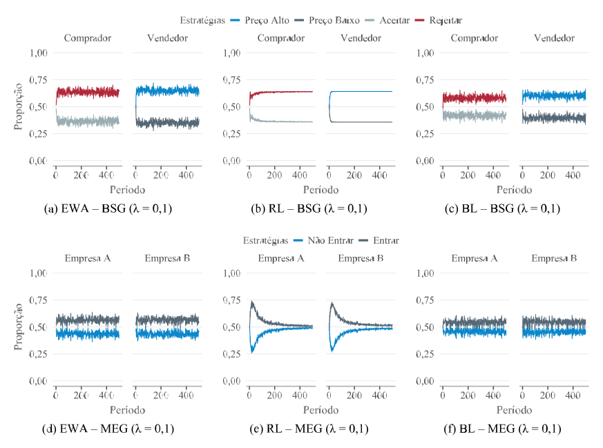
```

<p class="quarto-figure-attribution">
Fonte: Elaborado pelo autor (2026).
</p>

Nesse valor inicial de $\lambda$, a estabilidade deve ser interpretada com cautela. Ela marca a entrada em um regime de menor variação, não uma convergência plena. As médias estáveis mostram que as estratégias esperadas pelos jogos já se destacam, Rejeitar e Preço Alto no BSG, Entrar no MEG, ainda que com intensidade limitada quando comparadas aos cenários de maior sensibilidade.

Com $\lambda = 0{,}3$, a Figura @fig-ch5-2 mostra uma formação mais marcada das estratégias dominantes, com maior intensidade no BSG. Nesse jogo, o BL leva o Comprador à estabilidade em Rejeitar no período 13, com proporção média de 0,768, enquanto, para o Vendedor, a estabilidade ocorre no período 12, com média de 0,672 para Preço Alto. O EWA concentra ainda mais o comportamento do Comprador, estabilizado em Rejeitar no período 14, com média de 0,815. No caso do Vendedor, a estabilidade em Preço Alto aparece a partir do período 24, com média de 0,691. O RL também alcança estabilidade cedo, no período 10 para ambos os jogadores, embora siga outro padrão, já que as proporções próximas de 0,53 apontam mais para baixa oscilação das escolhas do que para uma consolidação estratégica em torno de uma alternativa dominante.

No MEG, BL e EWA reforçam a predominância de Entrar. O BL estabiliza a Empresa A no período 12 e a Empresa B no período 21, com médias de 0,604 e 0,601, ao passo que, no EWA, a estabilidade ocorre nos períodos 27 e 21, com médias um pouco superiores, de 0,621 e 0,628. O RL permanece próximo da indiferença, mesmo com estabilidade em períodos relativamente curtos, com média estável de 0,513 para Não Entrar na Empresa A e de 0,532 para Entrar na Empresa B. Em comparação com $\lambda = 0{,}1$, o aumento de $\lambda$ torna mais visível a separação entre os modelos. EWA e BL passam a expressar com maior nitidez a estrutura estratégica dos jogos, ao atribuir maior influência às estratégias teoricamente esperadas, enquanto o RL continua a estabilizar cedo, porém em torno de proporções pouco informativas para a interpretação estratégica.

```{r}
#| label: fig-ch5-2
#| fig-cap: 'Proporções de escolha das estratégias ao longo do tempo no BSG e no MEG para $\lambda = 0{,}3$'
#| fig-align: center
#| out-width: "90%"
#| fig-cap-location: top

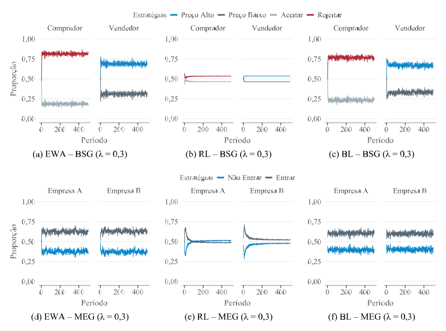
```

<p class="quarto-figure-attribution">
Fonte: Elaborado pelo autor (2026).
</p>

Na Figura @fig-ch5-3, o aumento de $\lambda$ para 0,5 acentua a diferenciação entre os modelos. No BSG, BL e EWA estabilizam o Comprador em Rejeitar no período 15, com proporções médias muito próximas, de 0,872 e 0,874, de modo que a estratégia passa a concentrar a maior parte das escolhas no regime estável, em vez de apenas aparecer como alternativa predominante. Para o Vendedor, os dois modelos também mantêm Preço Alto como estratégia dominante, embora com menor intensidade. O BL estabiliza no período 13, com média de 0,655, ao passo que o EWA atinge estabilidade no período 18, com média de 0,676. O RL segue outro padrão, com estabilidade cedo, entre os períodos 10 e 11, e médias em torno de 0,56 para Rejeitar e Preço Alto. A baixa variação das proporções, nesse caso, convive com uma concentração estratégica fraca.

No MEG, BL e EWA sustentam a predominância de Entrar para ambas as empresas, com médias estáveis próximas de 0,64. O BL estabiliza a Empresa A no período 16 e a Empresa B no período 10, com médias de 0,640 e 0,638, enquanto o EWA alcança estabilidade mais tarde, nos períodos 23 e 28, com médias de 0,646 e 0,641. O RL permanece praticamente em uma divisão indiferente, ainda que Entrar apareça como estratégia dominante, já que, para as duas empresas, a média estável é de apenas 0,508. Com $\lambda = 0{,}5$, EWA e BL apresentam um regime estável mais aderente à estrutura esperada dos jogos. O RL preserva sua marca nesses cenários e estabiliza cedo em torno de proporções pouco informativas para a consolidação estratégica substantiva.

```{r}
#| label: fig-ch5-3
#| fig-cap: 'Proporções de escolha das estratégias ao longo do tempo no BSG e no MEG para $\lambda = 0{,}5$'
#| fig-align: center
#| out-width: "90%"
#| fig-cap-location: top

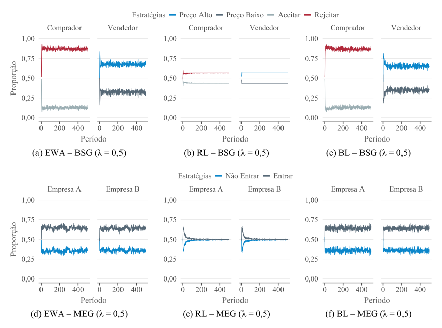
```

<p class="quarto-figure-attribution">
Fonte: Elaborado pelo autor (2026).
</p>

Com $\lambda = 0{,}8$, a Figura @fig-ch5-4 mostra, no BSG, maior consolidação da estratégia Rejeitar para o Comprador nos modelos BL e EWA, ainda que em intensidades distintas. No BL, o regime estável começa no período 13, com proporção média de 0,942, enquanto o EWA atinge estabilidade no mesmo período, com média menor, de 0,903. Para o Vendedor, os dois modelos preservam Preço Alto como estratégia dominante, com estabilidade no período 13 e média de 0,621 no BL, e no período 22, com média de 0,674 no EWA. O RL repete o padrão observado nos valores anteriores de $\lambda$. O modelo alcança estabilidade já no período 10 para os dois jogadores e mantém proporções próximas de 0,53, de modo que a baixa variação das escolhas não se transpõe em direção estratégica bem definida.

No MEG, BL e EWA continuam atribuindo maior influência à estratégia Entrar, ainda que com menor intensidade do que no BSG. O BL estabiliza a Empresa A no período 12 e a Empresa B no período 20, com médias de 0,654 e 0,666, enquanto, no EWA, as duas empresas entram em regime estável no período 12, com médias de 0,618 e 0,622. A entrada aparece de forma relativamente consistente, embora menos concentrada do que no BL. O RL permanece próximo da indiferença, com a Empresa A estabilizada em Não Entrar no período 13, com média de 0,505, e a Empresa B estabilizada em Entrar no período 12, com média de 0,511. Neste cenário, BL e EWA preservam padrões compatíveis com a estrutura dos jogos, enquanto, no RL, a estabilidade continua restrita à baixa oscilação das proporções, sem consolidação substantiva das estratégias.

```{r}
#| label: fig-ch5-4
#| fig-cap: 'Proporções de escolha das estratégias ao longo do tempo no BSG e no MEG para $\lambda = 0{,}8$'
#| fig-align: center
#| out-width: "90%"
#| fig-cap-location: top

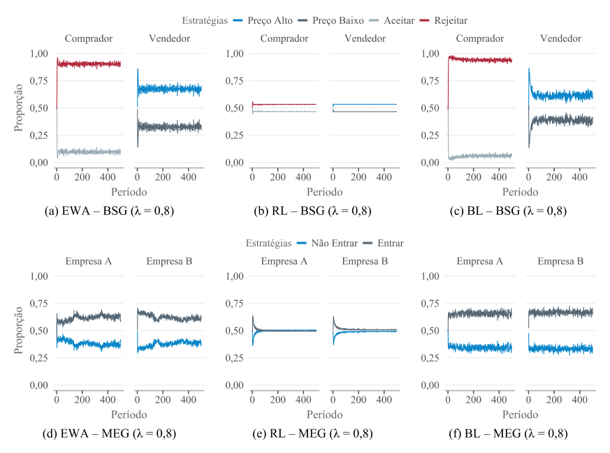
```

<p class="quarto-figure-attribution">
Fonte: Elaborado pelo autor (2026).
</p>

O padrão observado nos cenários anteriores aparece de forma mais acentuada, principalmente no BSG, conforme a Figura @fig-ch5-5, com $\lambda = 1{,}0$. Nesse jogo, BL e EWA mantêm a escolha de Rejeitar para o Comprador, como já ocorria em $\lambda = 0{,}3$, $\lambda = 0{,}5$ e $\lambda = 0{,}8$, com mudança apenas na intensidade da concentração durante o regime estável. No BL, a estabilidade ocorre no período 14, com proporção média de 0,966, enquanto, no EWA, aparece mais cedo, no período 11, com média de 0,911. Para o Vendedor, Preço Alto também permanece como estratégia dominante nesses dois modelos, ainda que em nível mais moderado, com estabilidade no período 11 e média de 0,595 no BL, e no período 18, com média de 0,675 no EWA.

O aumento da sensibilidade às atrações reforça, no BSG, principalmente a decisão do Comprador. A estratégia Rejeitar ganha maior influência em BL e EWA, enquanto a escolha do Vendedor permanece menos concentrada. O RL mantém a estabilidade precoce, no período 10 para ambos os jogadores, embora passe a selecionar Aceitar e Preço Baixo como estratégias dominantes, ambas com média de apenas 0,502. A dominância, nesse caso, é quase residual, já que as proporções seguem muito próximas de uma divisão indiferente entre as alternativas. No MEG, BL e EWA preservam o padrão observado nos valores intermediários e altos de $\lambda$, com predominância de Entrar para as duas empresas. O BL estabiliza a Empresa A no período 21 e a Empresa B no período 13, com médias de 0,641 e 0,664, enquanto, no EWA, a estabilidade ocorre nos períodos 14 e 12, com médias de 0,575 e 0,619.

```{r}
#| label: fig-ch5-5
#| fig-cap: 'Proporções de escolha das estratégias ao longo do tempo no BSG e no MEG para $\lambda = 1$'
#| fig-align: center
#| out-width: "90%"
#| fig-cap-location: top

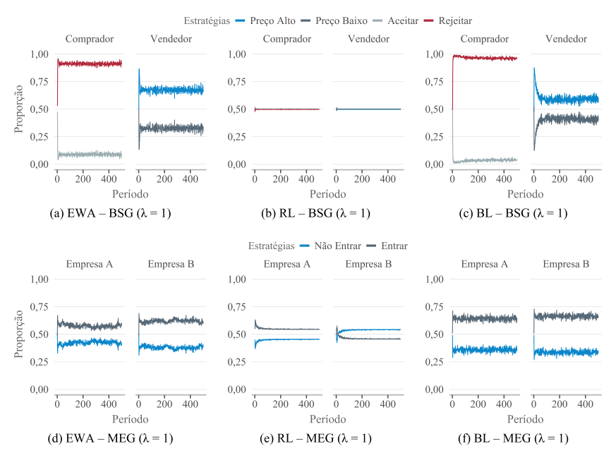
```

<p class="quarto-figure-attribution">
Fonte: Elaborado pelo autor (2026).
</p>

Em comparação com $\lambda = 0{,}5$ e $\lambda = 0{,}8$, o MEG preserva uma concentração mais limitada que o BSG. O jogo permanece menos polarizado e mais próximo de uma lógica mista, na qual a predominância de uma estratégia não elimina a presença da alternativa concorrente. No RL, a estratégia classificada como dominante alterna entre Entrar e Não Entrar, novamente com médias reduzidas, de 0,547 para a Empresa A e 0,540 para a Empresa B. Ao longo dos diferentes valores de $\lambda$, o RL apresenta estabilidade formal, com pouca oscilação das proporções, sem formar uma orientação estratégica consistente.

A Tabela @tbl-taxa-estabilidade apresenta a taxa de estabilidade, entendida como o grau de persistência da baixa variação dentro do regime estável identificado. A medida informa por quanto tempo as trajetórias permanecem regulares, todavia não equivale, por si só, à convergência estratégica. Uma trajetória pode oscilar pouco e ainda assim permanecer distante de uma estratégia com significado teórico para o jogo.

O RL clarifica essa diferença. O modelo apresenta taxas próximas ou iguais a 100% em praticamente todos os valores de $\lambda$, tanto no BSG quanto no MEG. Suas proporções variam pouco ao longo do tempo, embora essa regularidade nem sempre corresponda a uma escolha estratégica mais definida. Em vários casos discutidos anteriormente, a estabilidade ocorre em torno de valores próximos de 50%, mais próximos de uma quase indiferença entre alternativas do que de uma consolidação em torno de uma estratégia dominante.

EWA e BL apresentam taxas menores, porém mais informativas do ponto de vista comportamental. No BSG, o EWA mantém estabilidade elevada para o Comprador, passando de 83,5% em $\lambda = 0{,}1$ para valores acima de 90% nos níveis mais altos de $\lambda$. Para o Vendedor, a estabilidade fica em nível mais moderado, entre aproximadamente 83% e 88%. O aumento de $\lambda$ reforça a regularidade da decisão do Comprador, mas não elimina a maior complexidade da escolha do Vendedor, cuja estratégia depende da antecipação da resposta do outro agente.

O BL segue uma dinâmica próxima, principalmente para o Comprador no BSG. A taxa de estabilidade chega a 99,2% em $\lambda = 1$, acompanhando a forte persistência da estratégia dominante. Para o Vendedor, a taxa permanece mais baixa e relativamente estável, o que diferencia uma decisão mais direta, como Rejeitar, de uma escolha mais dependente da reação esperada do outro jogador, como Preço Alto. No MEG, EWA e BL apresentam estabilidade intermediária, em geral entre 81% e 91%. Esse comportamento combina com a estrutura do jogo de entrada em mercado, no qual a decisão das firmas preserva maior componente misto e menor polarização entre as alternativas.

```{r}
#| label: code-resumo-estabilidade
#| echo: true 
#| eval: false
#| code-fold: true 
#| code-summary: "Mostrar código: resumo da estabilidade para ε = 0,03"

purrr::map(estabilidades_eps$eps_0.03, ~ .x$resumo)
```

::: {#tbl-taxa-estabilidade}

```{r}
#| fig-align: center
#| out-width: "100%"
#| fig-cap-location: top

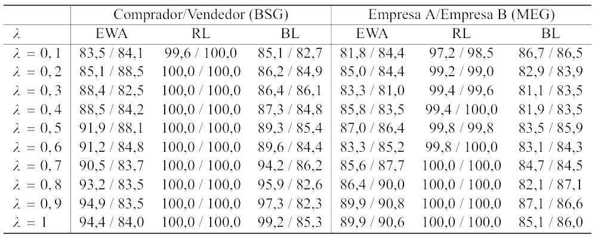
```

Taxa de estabilidade em porcentagem nos jogos BSG e MEG por modelo

:::

<p class="quarto-figure-attribution">
Nota: A estabilidade refere-se à persistência das proporções ao longo do tempo dentro de um intervalo de variação reduzido. Tal medida não implica convergência para estratégias de equilíbrio, podendo refletir padrões estacionários sem direcionamento estratégico, como observado no modelo RL. Fonte: Elaborado pelo autor (2026).
</p>

A comparação das variações médias após a entrada no regime estável mostra que a estabilidade não se forma pelo mesmo mecanismo em todos os modelos. No BSG, o aumento de $\lambda$ reduz principalmente a variação média do Comprador nos modelos EWA e BL. No EWA, a variação passa de aproximadamente $1{,}93%$ em $\lambda = 0{,}1$ para $1{,}22%$ em $\lambda = 1$. No BL, a queda é mais intensa, de $1{,}80%$ para $0{,}89%$. A decisão do Comprador torna-se mais regular conforme cresce a sensibilidade às atrações, o que dialoga com sua posição no jogo, já que sua escolha reage diretamente à proposta recebida.

Para o Vendedor, o mesmo movimento aparece com menor magnitude. No EWA, a variação permanece em torno de $1{,}8%$ ao longo dos diferentes valores de $\lambda$. No BL, passa de $1{,}83%$ para $1{,}95%$, sem tendência de redução. A persistência dessa variação está ligada à própria natureza da decisão do Vendedor, que envolve antecipar a resposta do Comprador, em vez de apenas reagir a uma condição já observada. O RL apresenta outro padrão. No Comprador, a variação cai de $0{,}39%$ para $0{,}06%$. No Vendedor, passa de $0{,}01%$ para praticamente $0%$. A estabilidade, nesse caso, parece decorrer mais de inércia comportamental do que de aprendizado estratégico em sentido substantivo.

No MEG, o padrão é menos polarizado. EWA e BL mantêm variações entre cerca de $1{,}5%$ e $1{,}9%$, sem queda expressiva à medida que $\lambda$ aumenta. Mesmo o RL oscila um pouco mais do que no BSG, com valores entre $0{,}24%$ e $0{,}85%$. A baixa variação das proporções continua explicando parte de sua estabilidade, mas a inércia é menos rígida nesse jogo. A entrada em mercado preserva mais espaço para alternância entre estratégias, o que dificulta a formação de trajetórias tão fixas quanto aquelas observadas no BSG.

## Dispersão das atrações e probabilidades de escolha {#sec-dispersao-atracoes}

A Tabela @tbl-ch5-4 mostra que, no modelo EWA, as atrações no BSG partem de valores mais elevados e dispersos, com média próxima de 4 e alto intervalo interquartil. À medida que $\lambda$ aumenta, esses valores convergem para níveis mais baixos e homogêneos. Com maior sensibilidade às diferenças entre atrações, os agentes passam a concentrar suas escolhas nas estratégias relativamente mais atrativas. A exploração diminui, os padrões de decisão se consolidam e, por isso, o desvio padrão e o intervalo interquartil caem até zero. Esse comportamento é compatível com a estrutura do BSG, que favorece a formação de um padrão decisório mais estável. No MEG, ocorre o movimento oposto. As médias aumentam e o intervalo interquartil se expande, sinalizando maior dispersão das atrações. Diferentemente do BSG, o MEG não conduz a um único padrão dominante. A competição estratégica admite múltiplas respostas, pois a decisão de entrar ou não entrar depende das expectativas sobre a escolha da outra empresa. Nesse ambiente, o aumento de $\lambda$ não produz convergência teórica. Ele amplifica diferenças iniciais entre os agentes. Parte deles reforça de maneira consistente a decisão de entrar no mercado, enquanto outra parte passa a evitar essa estratégia. O resultado são trajetórias mais heterogêneas, coerentes com a natureza estratégica do jogo.

```{r}
#| label: code-resumo-atracoes-ewa
#| echo: true
#| eval: false
#| code-fold: true
#| code-summary: "Mostrar código: medidas-resumo das atrações do EWA"

# Calcula as medidas-resumo das atrações no BSG e no MEG.
mr_lista <- base::list(
  mr_bsg = summary_statistics(
    df = bsg_df,
    sufixo = "m1"
  ),
  mr_meg = summary_statistics(
    df = meg_df,
    sufixo = "m2"
  )
)

# Organiza as medidas-resumo do modelo EWA.
tab_4 <- summary_tables(
  modelo = "EWA",
  lista_resumo = mr_lista
)
```

::: {#tbl-ch5-4}

```{r}
#| echo: false
#| fig-align: center
#| out-width: "100%"

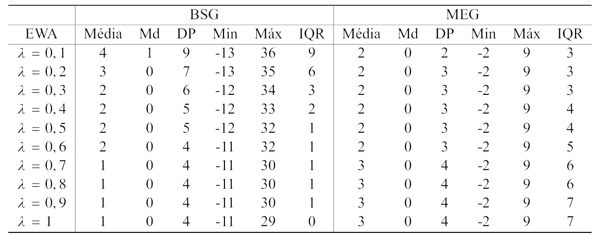
```

Medidas-resumo das atrações no modelo EWA para variações de $\lambda$ entre 0,1 e 1

:::

<p class="quarto-figure-attribution">Fonte: Elaborado pelo autor (2026).</p>


No modelo de aprendizado por reforço, conforme a Tabela @tbl-ch5-5, aparece um padrão distinto daquele observado nos demais modelos. As atrações permanecem em níveis elevados e com alta dispersão ao longo de todo o intervalo de $\lambda$. No BSG, as médias seguem altas e instáveis, enquanto o desvio padrão e o intervalo interquartil também assumem valores elevados. Esse comportamento aponta para forte heterogeneidade entre os agentes e para a ausência de uma direção comum das decisões. As medianas, bem inferiores às médias, revelam uma distribuição assimétrica. Poucos agentes acumulam valores muito altos de atração, provavelmente porque determinadas estratégias bem-sucedidas passam a ser reforçadas de forma contínua. No MEG, as médias são um pouco mais estáveis, mas a dispersão continua elevada, com crescimento gradual do intervalo interquartil. O aumento de $\lambda$, portanto, não produz alinhamento das decisões. O resultado, no entanto, é coerente com a própria lógica do RL, em que o aprendizado depende apenas dos *payoffs* realizados, sem incorporação de crenças nem avaliação contrafactual. Cada agente reforça sua trajetória a partir da experiência individual acumulada, o que amplia diferenças internas e dificulta a formação de um padrão comum.

```{r}
#| label: code-resumo-atracoes-rl
#| echo: true
#| eval: false
#| code-fold: true
#| code-summary: "Mostrar código: medidas-resumo das atrações do RL"

# Organiza as medidas-resumo das atrações do modelo RL
# para os jogos BSG e MEG.
tab_5 <- summary_tables(
  modelo = "RL",
  lista_resumo = mr_lista
)
```

::: {#tbl-ch5-5}

```{r}
#| echo: false
#| fig-align: center
#| out-width: "100%"

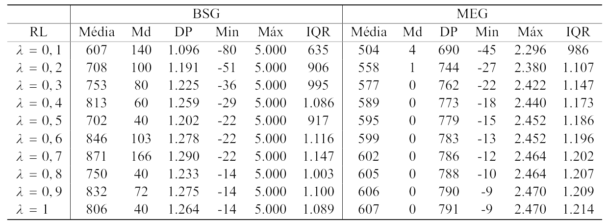
```

Medidas-resumo das atrações no modelo RL para variações de $\lambda$ entre 0,1 e 1

:::

<p class="quarto-figure-attribution">Fonte: Elaborado pelo autor (2026).</p>

No modelo baseado em crenças, conforme a Tabela @tbl-ch5-6, o BSG apresenta outro movimento. As atrações médias caem de 3 para 0 à medida que $\lambda$ cresce. O desvio padrão também diminui, de 5 para 1, e o intervalo interquartil recua de 8 para 1. A redução conjunta dessas medidas aponta para uma convergência mais forte das decisões. Com maior sensibilidade às diferenças de atração, os agentes ajustam suas escolhas a partir de crenças mais alinhadas sobre o comportamento do oponente, reduzindo a dispersão do aprendizado. As medianas nulas ao longo de todo o intervalo acrescentam uma nuance importante. A maior parte dos agentes se aproxima de níveis baixos de atração, enquanto poucos sustentam valores elevados. O padrão resultante é mais conservador, guiado pela estabilização das expectativas formadas nas interações passadas. No MEG, a dinâmica é menos convergente. As médias oscilam entre 1 e 1,2, enquanto o intervalo interquartil aumenta de 2 para 3. Em um ambiente de competição estratégica, o ajuste das crenças não leva necessariamente à uniformidade. A decisão ótima depende da expectativa sobre a ação do outro jogador, e pequenas diferenças nas crenças individuais podem ganhar expressividade quando $\lambda$ aumenta. As medianas positivas, embora decrescentes, apontam para uma convergência apenas parcial, acompanhada de heterogeneidade crescente na forma como os agentes avaliam o retorno esperado.

```{r}
#| label: code-resumo-atracoes-bl
#| echo: true
#| eval: false
#| code-fold: true
#| code-summary: "Mostrar código: medidas-resumo das atrações do BL"

# Organiza as medidas-resumo das atrações do modelo BL
# para os jogos BSG e MEG.
tab_6 <- summary_tables(
  modelo = "BL",
  lista_resumo = mr_lista
)
```

::: {#tbl-ch5-6}

```{r}
#| echo: false
#| fig-align: center
#| out-width: "100%"

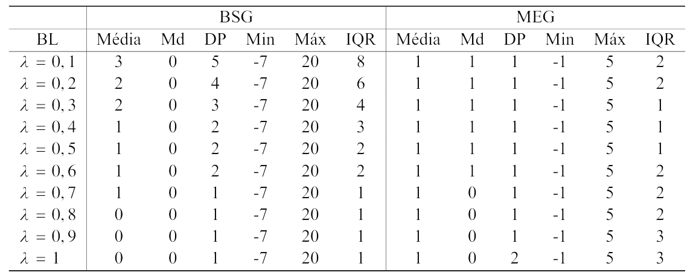
```

Medidas-resumo das atrações no modelo BL para variações de $\lambda$ entre 0,1 e 1

:::

<p class="quarto-figure-attribution">Fonte: Elaborado pelo autor (2026).</p>

As probabilidades médias permitem observar como as diferenças encontradas nas atrações aparecem nas escolhas efetivas dos agentes. No BSG, EWA e BL reproduzem o padrão adaptativo já apontado pelas medidas de atração. À medida que $\lambda$ aumenta, os agentes passam a responder com maior intensidade às estratégias relativamente mais vantajosas. O Vendedor, representado por P1, tende a sustentar o preço mais rentável. O Comprador, representado por P2, reage à incerteza da transação reforçando a rejeição.

Na Tabela @tbl-ch5-7, esse comportamento aparece de forma discriminável no EWA. A probabilidade média de Preço Alto aumenta de 0,708, em $\lambda = 0{,}1$, para 0,864, em $\lambda = 1$. No mesmo intervalo, Rejeitar cresce de 0,549 para 0,940. O BL segue direção próxima. Preço Alto passa de 0,625 para 0,797, enquanto Rejeitar avança de 0,493 para 0,870. O aprendizado baseado em crenças também aproxima os agentes da lógica estratégica do BSG, embora com menor intensidade que o EWA. O RL apresenta outro perfil, dado que suas probabilidades permanecem próximas de 1 em quase todo o intervalo, com valores entre 0,997 e 0,998 para o Vendedor e entre 0,960 e 0,996 para o Comprador. Os valores do RL apontam para um reforço muito intenso, mas pouco discriminativo entre as alternativas. Por isso, as probabilidades médias reforçam uma diferença importante entre os modelos, de que EWA e BL captam melhor a relação entre preço elevado, risco de aceitação e recusa da transação. O RL tende a reproduzir um padrão mais mecânico de reforço, menos sensível à estrutura estratégica do jogo.

```{r}
#| label: code-probabilidades-medias-bsg
#| echo: true
#| eval: false
#| code-fold: true
#| code-summary: "Mostrar código: probabilidades médias das estratégias no BSG"

# Calcula as probabilidades médias das estratégias no BSG,
# separadas por modelo, jogador e valor de lambda.
tab_7 <- frequency_probabilities(
  df = bsg_df
)
```

::: {#tbl-ch5-7}

```{r}
#| echo: false
#| fig-align: center
#| out-width: "100%"

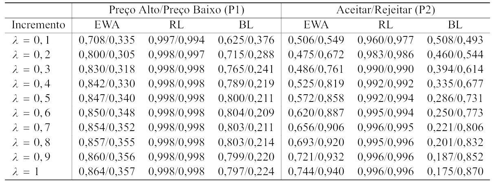
```

Probabilidades médias das estratégias no BSG segundo modelo de aprendizagem e $\lambda$

:::

<p class="quarto-figure-attribution">Fonte: Elaborado pelo autor (2026).</p>

No MEG, as escolhas aparecem menos concentradas, como mostra a Tabela @tbl-ch5-8. A decisão de entrar ou permanecer fora do mercado envolve a avaliação da própria posição estratégica diante da possível ação da concorrente. Como o ganho da entrada depende da escolha da outra empresa, a interdependência do jogo reduz a polarização das trajetórias e preserva a presença de estratégias alternativas ao longo das simulações. Na Tabela @tbl-ch5-8, em que P1 representa a Empresa A e P2 a Empresa B, o EWA registra aumento da probabilidade média de Entrar para ambas. Na Empresa A, a probabilidade passa de 0,570, em $\lambda = 0{,}1$, para 0,844, em $\lambda = 1$. Na Empresa B, cresce de 0,570 para 0,867.

A maior frequência de Entrar não retira Não Entrar da disputa estratégica. No EWA, essa alternativa também aumenta, passando de 0,444 para 0,787 na Empresa A e de 0,444 para 0,785 na Empresa B. O avanço de $\lambda$ separa melhor as trajetórias, embora permaneça a tensão entre ocupar o mercado e evitar a competição direta. No BL, Entrar cresce de modo mais moderado, de 0,543 para 0,762 na Empresa A e de 0,544 para 0,779 na Empresa B. Não Entrar continua abaixo de Entrar, mas também se eleva no final do intervalo. O RL mantém probabilidades altas para as duas estratégias, em geral acima de 0,92 e próximas de 0,99 quando $\lambda = 1$.

::: {#tbl-ch5-8}

```{r}
#| label: code-probabilidades-medias-meg
#| echo: true
#| eval: false
#| code-fold: true
#| code-summary: "Mostrar código: probabilidades médias das estratégias no MEG"

# Calcula as probabilidades médias das estratégias no MEG,
# separadas por modelo, jogador e valor de lambda.
tab_8 <- frequency_probabilities(
  df = meg_df
)
```

```{r}
#| echo: false
#| fig-align: center
#| out-width: "100%"

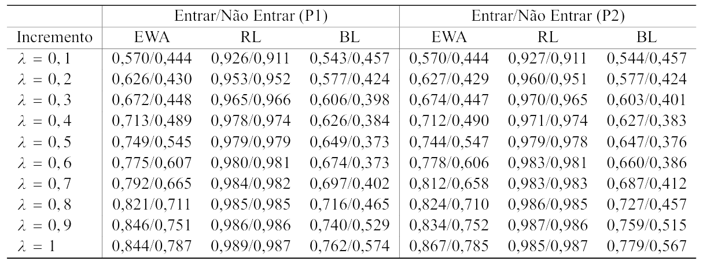
```

Probabilidades médias das estratégias no MEG segundo modelo de aprendizagem e $\lambda$

:::

<p class="quarto-figure-attribution">Fonte: Elaborado pelo autor (2026).</p>

Reaparece, em vista disso, o reforço intenso e pouco seletivo já observado no BSG. EWA e BL captam melhor a instabilidade característica do MEG, assim como haviam registrado com mais precisão o ajuste adaptativo no BSG. A diferença está na forma assumida por esse ajuste. No BSG, as escolhas se concentram com maior nitidez, pois o Vendedor reforça Preço Alto e o Comprador reforça Rejeitar. No MEG, a resposta é menos definida, já que Entrar aumenta com $\lambda$, mas Não Entrar continua presente na estrutura de decisão porque permanece ligado ao risco de competição simultânea entre as empresas.

## Estrutura distributiva das probabilidades {#sec-estrutura-distributiva}

As Figuras @fig-ch5-6 e @fig-ch5-7 apresentam histogramas facetados pelos valores de $\lambda$. O eixo horizontal registra as probabilidades de escolha, enquanto o eixo vertical informa a densidade das observações. As barras mostram a distribuição dessas probabilidades entre os agentes em cada modelo. As linhas pontilhadas marcam as medianas e ajudam a acompanhar o deslocamento típico das escolhas conforme $\lambda$ aumenta. Com isso, os histogramas acrescentam uma camada à análise das médias, pois permitem observar a dispersão das probabilidades em cada jogo.

```{r}
#| label: code-histogramas-probabilidades
#| echo: true
#| eval: false
#| code-fold: true
#| code-summary: "Mostrar código: distribuição das probabilidades no BSG e no MEG"

# Gera os histogramas das probabilidades de escolha
# para os jogos BSG e MEG.

plot_histogram(
  data = bsg_df,
  bins = grDevices::nclass.Sturges(bsg_df$probabilidade),
  file_name = "figuras/figura_13.pdf"
)

plot_histogram(
  data = meg_df,
  bins = grDevices::nclass.Sturges(meg_df$probabilidade),
  file_name = "figuras/figura_14.pdf"
)
```

No BSG, representado pela Figura @fig-ch5-6, o EWA apresenta, em $\lambda = 0{,}1$, uma distribuição relativamente regular, concentrada entre 0,50 e 0,70. A maior presença de probabilidades intermediárias aponta para heterogeneidade moderada e exploração mais ampla das estratégias disponíveis. Com o aumento de $\lambda$, a distribuição se amplia e parte das observações se desloca para valores mais altos, próximos de 0,80 e 1,00. As escolhas dos agentes passam a se diferenciar com mais intensidade. O BL preserva uma distribuição mais ordenada, embora assimétrica, com concentração em probabilidades intermediárias e altas. O RL segue outra configuração, já que suas observações permanecem enviesadas para o limite superior, próximas de 1 em quase todos os incrementos de $\lambda$. O reforço opera de maneira intensa, porém pouco seletiva entre alternativas. No BSG, a partir disso, o aumento de $\lambda$ não altera apenas médias e medianas, também reorganiza-se a forma da distribuição, reduzindo a presença de probabilidades intermediárias e tornando as escolhas mais sensíveis às atrações acumuladas.
```{r}
#| label: fig-ch5-6
#| fig-cap: 'Distribuição das probabilidades de escolha por modelo no BSG'
#| fig-align: center
#| out-width: "100%"
#| fig-cap-location: top

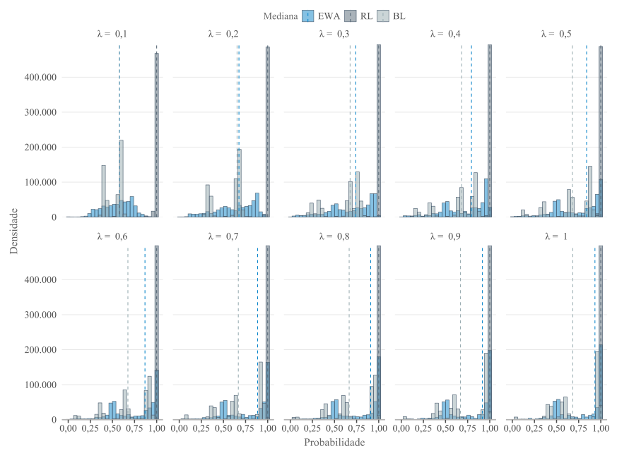
```

<p class="quarto-figure-attribution">Fonte: Elaborado pelo autor (2026).</p>

A Figura @fig-ch5-7 mostra que o MEG produz distribuições mais espalhadas do que o BSG. No EWA, as probabilidades partem de uma estrutura mais organizada em valores intermediários, mas se dispersam conforme $\lambda$ aumenta, com presença crescente em faixas médias e altas. O BL segue dinâmica semelhante, porém com assimetria mais marcada, sinalizando que as crenças acumuladas ampliam a diferenciação entre as trajetórias dos agentes. O RL novamente permanece “espremido” próximo de 1 em quase todos os incrementos, além de repetir o padrão de reforço intenso e pouco discriminativo. A diferença central em relação ao BSG está no fato de que, no MEG, a concentração não elimina a dispersão. Mesmo quando as medianas avançam para valores mais altos, ainda existe densidade relevante entre 0,40 e 0,80, sobretudo no EWA e no BL. O jogo de entrada em mercado preserva, portanto, trajetórias mais heterogêneas. A escolha entre Entrar e Não Entrar continua condicionada pela expectativa sobre o comportamento da concorrente, o que dificulta a formação de um padrão único de decisão.
```{r}
#| label: fig-ch5-7
#| fig-cap: 'Distribuição das probabilidades de escolha por modelo no MEG'
#| fig-align: center
#| out-width: "100%"
#| fig-cap-location: top

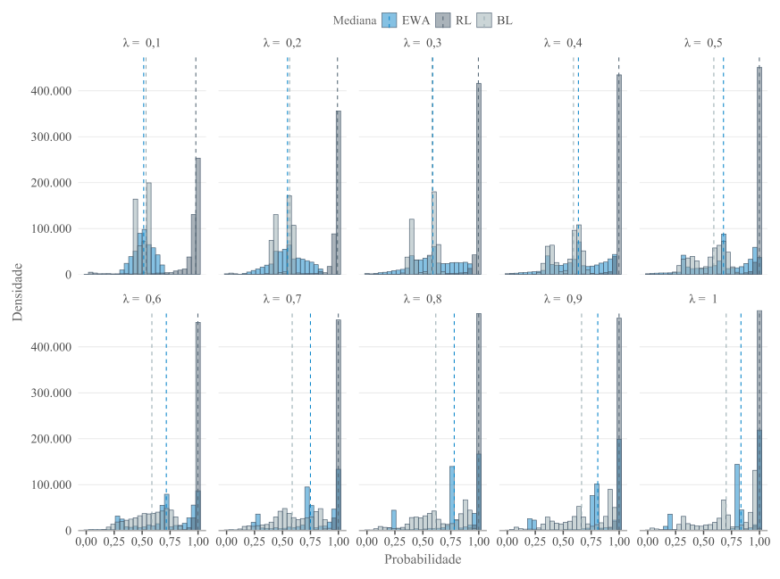
```

<p class="quarto-figure-attribution">Fonte: Elaborado pelo autor (2026).</p>

A Figura @fig-ch5-8 apresenta as distribuições acumuladas empíricas das probabilidades de escolha das estratégias associadas ao equilíbrio teórico dos dois jogos. A figura está organizada em dois pares de comparação. Nos painéis (a1), (a2) e (a3), compara-se a probabilidade de o Comprador escolher “Rejeitar” no BSG com a probabilidade de a Empresa A escolher “Entrar” no MEG, considerando os modelos EWA, RL e BL. Nos painéis (b1), (b2) e (b3), a comparação envolve a probabilidade de o Vendedor escolher “Preço Alto” no BSG e a probabilidade de a Empresa B escolher “Entrar” no MEG. Como cada jogador possui apenas duas estratégias, observar uma delas também informa o comportamento da alternativa, já que o aumento da probabilidade de uma escolha implica a redução da outra.

```{r}
#| label: code-preparacao-ecdf
#| echo: true
#| eval: false
#| code-fold: true
#| code-summary: "Mostrar código: preparação das probabilidades para as curvas ECDF"

# Define os pares estratégicos comparados entre os jogos.
pares <- list(
  p1 = list(
    comparacao = "Comprador (BSG) vs Empresa A (MEG)",
    jogador_bsg = "Comprador",
    estrategia_bsg = "Rejeitar",
    jogador_meg = "Empresa A",
    estrategia_meg = "Entrar"
  ),
  p2 = list(
    comparacao = "Vendedor (BSG) vs Empresa B (MEG)",
    jogador_bsg = "Vendedor",
    estrategia_bsg = "Preço Alto",
    jogador_meg = "Empresa B",
    estrategia_meg = "Entrar"
  )
)

# Constrói as bases de probabilidades para os dois pares.
probs_lista <- purrr::imap(
  pares,
  ~ build_probs_compare(
    bsg_df = bsg_df,
    meg_df = meg_df,
    jogador_bsg = .x$jogador_bsg,
    estrategia_bsg = .x$estrategia_bsg,
    jogador_meg = .x$jogador_meg,
    estrategia_meg = .x$estrategia_meg,
    par_label = .y
  )
)
```

No eixo horizontal, estão as probabilidades individuais de adoção da estratégia selecionada, variando de 0, quando a estratégia não é escolhida, a 1, quando é sempre escolhida. O eixo vertical mostra a fração acumulada de observações até cada ponto, isto é, a proporção de casos com probabilidade de escolha menor ou igual ao valor indicado. Curvas próximas revelam distribuições semelhantes entre os jogos. Afastamentos maiores mostram que o modelo organiza as probabilidades de modo diferente nos papéis estratégicos comparados.

A amostra de 200 mil observações por grupo foi adotada por razões computacionais e gráficas. A base completa contém milhões de observações, o que tornaria a construção das curvas mais custosa e visualmente redundante. A amostragem aleatória por grupo preserva a estrutura das comparações entre modelos e jogos, enquanto o tamanho amostral elevado reduz a instabilidade associada ao sorteio.

Nos painéis (a1), (a2) e (a3), a comparação entre BSG e MEG mostra que os modelos de aprendizagem alteram não apenas o nível das probabilidades, mas também o formato das distribuições. No EWA, painel (a1), o BSG aparece mais polarizado. Entre as observações do Comprador, 32,6% estão entre 0 e 0,1, e outros 32,6% entre 0,9 e 1. No MEG, esses percentuais são menores, de 20,7% e 20,6%. O EWA, portanto, gera mais trajetórias extremas de rejeição no BSG, enquanto a Empresa A no MEG conserva maior presença em faixas intermediárias. No RL, painel (a2), o padrão é mais rígido. Quase metade das observações aparece em cada extremo, tanto no BSG quanto no MEG, com participação residual nas faixas centrais. As curvas quase se sobrepõem e assumem formato em degrau, traço de uma dinâmica de reforço pouco sensível às diferenças entre os jogos. No BL, painel (a3), o contraste é mais visível. O BSG mantém concentração nos extremos, mas também acumula massa nas faixas adjacentes, como 0,1--0,2 e 0,8--0,9, o que ajuda a explicar a curva mais irregular. O MEG, por sua vez, concentra-se mais no centro, prioritariamente entre 0,4 e 0,6. 

Nos painéis (b1), (b2) e (b3), a comparação entre o Vendedor no BSG e a Empresa B no MEG também revela importantes diferenças na forma das distribuições. No EWA, painel (b1), o BSG apresenta maior concentração em probabilidades intermediárias, com 18,7% das observações entre 0,4 e 0,5 e 18,2% entre 0,5 e 0,6. Os extremos concentram cerca de 24,1%. No MEG, a distribuição da Empresa B é mais polarizada, com 20,8% das observações entre 0 e 0,1 e 21,0% entre 0,9 e 1, embora ainda haja presença relevante nas faixas centrais. No RL, painel (b2), repete-se o padrão extremo do modelo. No BSG, 49,7% das observações estão entre 0 e 0,1, e 49,8% entre 0,9 e 1. No MEG, os valores são muito próximos, com 48,8% e 48,7%. A quase ausência de probabilidades intermediárias explica a sobreposição das curvas e o formato em degrau. No BL, painel (b3), o contraste entre os jogos é mais forte. O BSG concentra a maior parte das observações em duas faixas específicas, 0,3--0,4 e 0,6--0,7, ambas com cerca de 36,8%, formando uma distribuição em blocos, pouco concentrada nos extremos. No MEG, a Empresa B se concentra mais nas faixas centrais. As maiores participações aparecem entre 0,4--0,5 e 0,5--0,6, com 19,0% e 18,6%.

```{r}
#| label: code-curvas-ecdf
#| echo: true
#| eval: false
#| code-fold: true
#| code-summary: "Mostrar código: construção das curvas ECDF entre BSG e MEG"

set.seed(05052026)

# Prepara uma amostra de 200 mil observações por grupo.
probs_plot_lista <- purrr::map(
  probs_lista,
  ~ prep_ecdf(
    .x,
    n_por_grupo = 200000
  )
)

# Constrói os painéis do primeiro par estratégico.
comparacao_p1 <- make_ecdf_subpatch(
  df_probs = probs_lista$p1,
  prefixo = "a",
  pal_jogo = c(
    BSG = color_main[1],
    MEG = color_main[2]
  ),
  fonte_base = fonte_base,
  base_size = 16,
  n_por_grupo = 200000,
  preparar = TRUE
)

# Constrói os painéis do segundo par estratégico.
comparacao_p2 <- make_ecdf_subpatch(
  df_probs = probs_lista$p2,
  prefixo = "b",
  pal_jogo = c(
    BSG = color_main[1],
    MEG = color_main[2]
  ),
  fonte_base = fonte_base,
  base_size = 16,
  n_por_grupo = 200000,
  preparar = TRUE
)
```

```{r}
#| label: fig-ch5-8
#| fig-cap: 'Distribuições acumuladas empíricas das probabilidades de escolha das estratégias associadas ao equilíbrio teórico nos jogos BSG e MEG'
#| fig-align: center
#| out-width: "100%"
#| fig-cap-location: top


```

<p class="quarto-figure-attribution">Fonte: Elaborado pelo autor (2026).</p>

A comparação dos painéis bem separa o comportamento dos modelos. O RL concentra as probabilidades nos limites, tanto no BSG quanto no MEG, e com isso reduz a distinção entre os dois ambientes estratégicos. EWA e BL preservam diferenças mais visíveis entre os papéis analisados. No BL, o BSG apresenta uma distribuição mais segmentada, enquanto o MEG permanece mais concentrado nas faixas centrais. Esse formato combina com a estrutura do jogo de entrada, em que a decisão de cada empresa depende da expectativa sobre a ação da concorrente e tende a manter maior espaço para respostas intermediárias.

O teste de Kolmogorov-Smirnov aponta diferenças estatisticamente significativas entre as distribuições em todos os casos. Como as simulações geram um número elevado de observações e há empates nas probabilidades, a análise se concentrou na estatística D, tomada como medida da distância distributiva entre os jogos. Nos painéis do EWA, as curvas do BSG e do MEG aparecem relativamente próximas, em especial no segundo par estratégico. Os valores de D acompanham essa proximidade: D = 0,139 para o par Comprador–Empresa A e D = 0,0969 para o par Vendedor–Empresa B.

```{r}
#| label: code-teste-ks-entre-jogos
#| echo: true
#| eval: false
#| code-fold: true
#| code-summary: "Mostrar código: teste KS entre os jogos BSG e MEG"

# Compara as distribuições do BSG e do MEG para cada
# modelo de aprendizagem e par estratégico.
ks_results_all <- purrr::imap_dfr(
  probs_lista,
  ~ run_ks_by_model(
    .x,
    comparacao_label = pares[[.y]]$comparacao
  )
)
```

No RL, no entanto, a leitura do teste exige mais cautela. A Figura @fig-ch5-8 mostra forte semelhança visual entre BSG e MEG, já que ambos concentram quase toda a distribuição nos extremos do intervalo. Mesmo assim, os valores de D são elevados, com D = 0,469 no primeiro par e D = 0,451 no segundo. A distância, nesse caso, parece estar menos ligada à tendência central ou ao desenho geral das curvas e mais à distribuição fina das massas acumuladas nos extremos. O teste com a distribuição complementar $(1-p)$ produziu resultado semelhante, afastando a hipótese de que a diferença decorra apenas de uma inversão entre estratégias complementares. O teste de Kolmogorov-Smirnov aponta diferenças estatisticamente significativas entre as distribuições em todos os casos. 

A Figura @fig-ch5-9 apresenta a evolução da distância KS (D) entre os modelos de aprendizagem, calculada separadamente por jogo, papel estratégico e valor de $\lambda$. No painel (a), referente ao BSG, aparecem os resultados para o Comprador e para o Vendedor. Para o Comprador, a distância entre EWA e RL começa elevada, em torno de D = 0,493 quando $\lambda = 0{,}1$, e cai de forma acentuada à medida que $\lambda$ aumenta, chegando a aproximadamente D = 0,279 em $\lambda = 1$. A distribuição do EWA, nesse papel, aproxima-se da distribuição do RL quando cresce a sensibilidade às atrações. A comparação entre RL e BL permanece praticamente constante e elevada, próxima de D = 0,496. Já a distância entre EWA e BL ocupa uma faixa intermediária, entre D = 0,32 e D = 0,35. Para o Vendedor, ainda no BSG, as distâncias que envolvem o RL ficam quase no limite superior observado. EWA vs RL e RL vs BL permanecem em torno de D = 0,498 ao longo de todos os valores de $\lambda$. A distância entre EWA e BL é menor, variando aproximadamente entre D = 0,214 e D = 0,283. Nesse papel estratégico, EWA e BL apresentam distribuições mais próximas entre si, enquanto o RL se mantém afastado dos dois modelos em praticamente toda a faixa de $\lambda$.

No painel (b), referente ao MEG, as distâncias apresentam comportamento semelhante para Empresa A e Empresa B. Nas duas empresas, as comparações EWA vs RL e RL vs BL permanecem elevadas, próximas de D = 0,48 a D = 0,49. O RL mantém, com isso, uma distribuição bastante afastada das distribuições geradas por EWA e BL. A variação mais visível aparece na comparação entre EWA e BL. Para a Empresa A, a distância parte de D = 0,270, cai levemente até cerca de D = 0,261 em $\lambda = 0{,}3$ e depois cresce até D = 0,355 em $\lambda = 1$. Na Empresa B, a trajetória é parecida, saindo de D = 0,268 e chegando a D = 0,368 em $\lambda = 1$. No MEG, o aumento de $\lambda$ amplia gradualmente a separação distributiva entre EWA e BL, enquanto o RL permanece distante dos demais modelos em quase todo o intervalo analisado.

```{r}
#| label: code-distancia-ks-modelos
#| echo: true
#| eval: false
#| code-fold: true
#| code-summary: "Mostrar código: distância KS entre modelos por valor de lambda"

# Compara os pares EWA–RL, EWA–BL e RL–BL
# dentro de cada jogo e valor de lambda.
ks_lambda_all <- purrr::imap_dfr(
  probs_lista,
  function(probs_par, nome_par) {

    dplyr::bind_rows(
      run_ks_all_pairs_lambda(probs_par, "BSG"),
      run_ks_all_pairs_lambda(probs_par, "MEG")
    ) |>
      dplyr::mutate(
        comparacao_par = pares[[nome_par]]$comparacao,
        p_value_adj = stats::p.adjust(
          p_value,
          method = "bonferroni"
        )
      )
  }
)

# Constrói o gráfico da evolução da distância KS.
p16 <- plot_ks_lambda(
  ks_lambda_all = ks_lambda_all,
  fonte_base = fonte_base
)
```

```{r}
#| label: fig-ch5-9
#| fig-cap: 'Evolução da distância KS entre os modelos de aprendizagem nos jogos BSG e MEG'
#| fig-align: center
#| out-width: "100%"
#| fig-cap-location: top

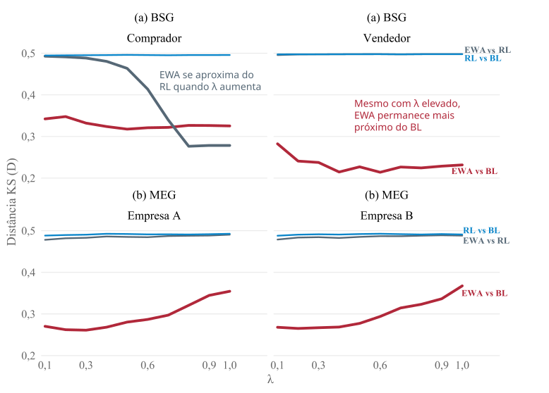
```

<p class="quarto-figure-attribution">Fonte: Elaborado pelo autor (2026).</p>

As Figuras @fig-ch5-8 e @fig-ch5-9 cumprem funções complementares. A primeira compara os jogos dentro de cada modelo. A segunda desloca o foco para a comparação entre modelos dentro de cada jogo, acompanhando os diferentes valores de $\lambda$. Na Figura @fig-ch5-8, o EWA apresenta as menores distâncias entre BSG e MEG nos dois pares estratégicos, seguido pelo BL. O RL registra os maiores valores de $D$. A princípio, isso aponta para maior semelhança distributiva do EWA entre ambientes estratégicos distintos, enquanto o RL se mostra mais sensível às características específicas de cada jogo. A Figura @fig-ch5-9 ajuda a qualificar essa leitura. O RL permanece distante dos demais modelos em quase todos os painéis, com $D$ próximo de 0,5, sinal de uma dinâmica mais polarizada e fortemente dependente dos *payoffs* efetivamente realizados.

A exceção aparece no BSG para o Comprador. Nesse caso, a distância entre EWA e RL diminui conforme $\lambda$ aumenta. A decisão do Comprador é mais reativa à oferta e à valoração observada do bem. Com maior sensibilidade às atrações, o EWA se aproxima do padrão extremo produzido pelo RL. Para o Vendedor, a lógica é diferente. Como sua decisão exige antecipar a resposta do Comprador, o EWA permanece mais próximo do BL. Tal interpretação encontra respaldo conceitual em trabalhos recentes sobre precificação dinâmica, ainda que esses estudos adotem modelos distintos dos algoritmos EWA, RL e BL. Em estudos de @liu2025contextual, os autores desenvolvem um modelo de precificação dinâmica contextual com compradores estratégicos, no qual os consumidores podem manipular características observadas para obter preços menores, cabendo ao vendedor aprender uma política de preços a partir de respostas binárias de compra. Já @guo2024leveraging analisam um modelo de precificação online baseado em avaliações, no qual os compradores formam sua disposição a pagar a partir de reviews de agentes do mesmo tipo, enquanto o vendedor aprende a definir preços sem conhecer a distribuição dos tipos no mercado. Em ambos os casos, a decisão de compra depende de uma comparação entre preço, valoração percebida e informação disponível, enquanto a decisão do vendedor envolve antecipar como os compradores reagirão à política de preços. 

No MEG, a competição direta entre empresas e a presença de equilíbrios puros assimétricos, ao lado do equilíbrio misto simétrico, tornam a comparação entre modelos sensível à maneira como cada regra de aprendizagem trata a experiência estratégica. A literatura experimental sobre jogos de entrada ajuda a situar esse resultado. Em um *Market Entry Game* com 12 jogadores, @erev1998coordination mostram que regras simples de aprendizado por reforço podem aproximar o resultado agregado do equilíbrio mesmo quando os participantes dispõem de informação limitada. Os autores observam, porém, que o modelo básico de Roth-Erev perde poder explicativo quando os jogadores recebem informações sobre os *payoffs* dos demais, já que esse tipo de informação altera o número de entrantes. Esse limite do reforço puro é reforçado por @john2005learning, que mostram, em *Market Entry Games* repetidos, que a aprendizagem tende a gerar *sorting*, com alguns agentes entrando de forma persistente e outros permanecendo fora. Esse processo ocorre mais rapidamente quando os jogadores observam as escolhas individuais dos demais, o que indica que a coordenação em jogos de entrada depende da avaliação do comportamento dos outros participantes.

O contraponto entre regularidade agregada e diferenciação individual também aparece em @kirman2023relaxing. Em jogos de participação, os autores mostram que a taxa média de entrada pode se aproximar da previsão de equilíbrio mesmo quando os jogadores seguem padrões individuais bastante heterogêneos. A regularidade no agregado, nesse caso, convive com diferenças persistentes nas trajetórias de escolha.

Esses argumentos ajudam a interpretar os dois jogos analisados, ainda que por caminhos diferentes. No BSG, a diferença passa pelos papéis do Comprador e do Vendedor, que aproximam o EWA de modelos distintos conforme a posição estratégica ocupada. No MEG, a interdependência da entrada aproxima EWA e BL, cuja distância distributiva é menor do que nas comparações envolvendo RL. A decisão de entrar depende da ação concorrente e da avaliação de alternativas não escolhidas, elementos que aparecem com mais intensidade nos modelos baseados em crenças ou em atrações ponderadas pela experiência. O reforço puro capta parte da adaptação gerada pelo *payoff* realizado, porém permanece mais preso ao ganho próprio observado. A distância entre os modelos varia com $\lambda$ e também com a estrutura do jogo, o papel do agente e o tipo de informação mobilizado na atualização das escolhas.

## Aderência ao equilíbrio teórico {#sec-aderencia-equilibrio}

A Tabela @tbl-ch5-9 apresenta a distribuição percentual agregada das probabilidades associadas às estratégias dos jogadores em cada jogo e modelo de aprendizagem. Em cada linha, as probabilidades das estratégias foram somadas e normalizadas para totalizar 100%. Os valores devem ser interpretados como participação relativa de cada estratégia no conjunto agregado de probabilidades produzido por cada modelo, sem associação direta a uma rodada específica da simulação. A linha “Total” resume a distribuição média sem separar EWA, RL e BL e serve como ponto de comparação para observar os desvios de cada dinâmica de aprendizagem.

No BSG, a distribuição total se concentra mais em “Rejeitar” (36,8%) e “Preço Alto” (30,6%). Nos modelos EWA e BL, “Rejeitar” alcança 42,1%, acima da média agregada, e “Preço Alto” também aparece com maior presença em relação ao RL. O RL apresenta uma composição mais distribuída, com percentuais próximos entre as quatro estratégias, reduzindo a concentração nas alternativas que predominam nos demais modelos. No MEG, a distribuição entre as empresas é mais simétrica. EWA e BL concentram as escolhas em “Entrar”, com valores próximos de 31% para ambas as empresas. O RL se aproxima novamente de uma divisão quase uniforme entre Entrar e Não Entrar, com cerca de 25% em cada alternativa.

No MEG, a simetria entre as empresas decorre do dilema estratégico comum às duas. A entrada pode gerar ganho individual quando a concorrente permanece fora do mercado, todavia também pode produzir perda quando ambas entram ao mesmo tempo. A distribuição percentual mostra como cada modelo organiza essa tensão. EWA e BL concentram maior participação nas estratégias associadas ao equilíbrio teórico, enquanto o RL mantém uma composição agregada mais balanceada, apesar da polarização observada nas distribuições completas. A Figura @fig-ap-19, apresentada no Apêndice, reproduz a distribuição em barras empilhadas e permite comparar jogos, modelos e estratégias em uma mesma visualização.

```{r}
#| label: code-distribuicao-percentual-estrategias
#| echo: true
#| eval: false
#| code-fold: true
#| code-summary: "Mostrar código: distribuição percentual das estratégias"

# Constrói as tabelas de contingência entre os modelos
# de aprendizagem e as estratégias escolhidas.
contigencia <- contingency_plots(
  data_m1 = bsg_df,
  data_m2 = meg_df,
  matrix_m1 = matriz_bsg,
  matrix_m2 = matriz_meg,
  tag_label_m1 = "(a) BSG",
  tag_label_m2 = "(b) MEG"
)

# As distribuições percentuais agregadas são armazenadas
# separadamente para o BSG e o MEG.
tabela_9a <- list(
  prob = contigencia$tables$tab_rel_total_m1
)

tabela_9b <- list(
  prob = contigencia$tables$tab_rel_total_m2
)
```

::: {#tbl-ch5-9}

```{r}
#| echo: false
#| fig-align: center
#| out-width: "100%"

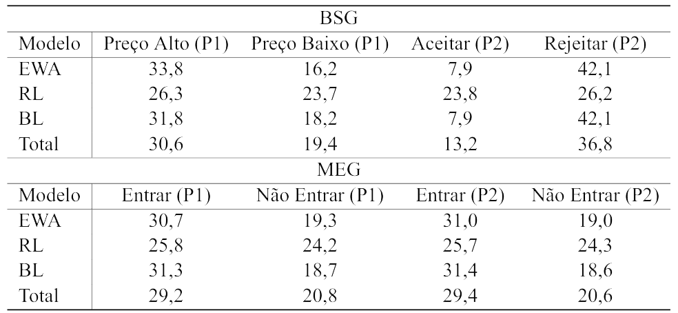
```

Distribuição percentual das estratégias nos jogos BSG e MEG segundo modelo de aprendizagem

:::

<p class="quarto-figure-attribution">Fonte: Elaborado pelo autor (2026).</p>


As frequências esperadas e os resíduos padronizados do teste $\chi^2$ foram utilizados como recursos descritivos para examinar a distribuição empírica das estratégias geradas pelos modelos de aprendizagem. As frequências esperadas correspondem aos valores que seriam observados caso a distribuição das estratégias não variasse conforme o modelo de aprendizagem. Os resíduos mostram quais estratégias aparecem acima ou abaixo desse padrão médio. Resíduos padronizados positivos significam que determinada estratégia aparece mais naquele modelo do que seria esperado sob independência entre modelo e estratégia. Resíduos negativos apontam o contrário. Como a base simulada possui elevado número de observações, os resíduos assumem magnitudes expressivas. Por isso, a interpretação recai principalmente sobre o sinal e sobre o padrão relativo dos desvios, não sobre sua magnitude absoluta. A fundamental compreensão desses desvios depende de um passo adicional, que implica verificar se as estratégias sobrerrepresentadas se aproximam das estratégias associadas aos equilíbrios teóricos do BSG e do MEG, conforme apresentado na Tabela @tbl-ch5-10.

No BSG, os resíduos padronizados separam o RL dos modelos EWA e BL. Em EWA e BL, os resíduos são positivos para “Preço Alto” e “Rejeitar” e negativos para “Aceitar” e “Preço Baixo”, o que mostra maior presença dessas duas primeiras estratégias em relação ao padrão esperado sob independência. O RL ocupa a direção oposta. Seus resíduos são positivos em “Aceitar” e “Preço Baixo” e negativos em “Preço Alto” e “Rejeitar”. Do ponto de vista teórico, EWA e BL concentram devida importância nas estratégias associadas ao padrão de equilíbrio considerado para o BSG, enquanto o RL desloca parte da distribuição para alternativas fora desse eixo.

No MEG, os resíduos assumem uma configuração mais simétrica entre as empresas. EWA e BL apresentam resíduos positivos para “Entrar” tanto na Empresa A quanto na Empresa B, acompanhados de resíduos negativos para “Não Entrar”. No RL, a distribuição se reorganiza em torno da não entrada, com sub-representação de “Entrar” e sobrerrepresentação de “Não Entrar”. Como a parametrização do MEG atribui maior relevância teórica à entrada no equilíbrio misto, EWA e BL permanecem mais alinhados à direção estratégica prevista pelo jogo. O RL se distancia desse esboço agregado ao concentrar maior valor relativo na não entrada.

```{r}
#| label: code-residuos-qui-quadrado
#| echo: true
#| eval: false
#| code-fold: true
#| code-summary: "Mostrar código: frequências esperadas e resíduos do teste qui-quadrado"

# Aplica o teste qui-quadrado à tabela de frequências
# observadas do BSG.
chi_bsg <- stats::chisq.test(
  contigencia$tables$tab_abs_m1
)

# Aplica o teste qui-quadrado à tabela de frequências
# observadas do MEG.
chi_meg <- stats::chisq.test(
  contigencia$tables$tab_abs_m2
)

# Organiza as frequências esperadas e os resíduos
# padronizados utilizados na Tabela 10.
tabela_10_bsg <- list(
  esperado = chi_bsg$expected,
  residuo_padronizado = chi_bsg$stdres
)

tabela_10_meg <- list(
  esperado = chi_meg$expected,
  residuo_padronizado = chi_meg$stdres
)
```

::: {#tbl-ch5-10}

```{r}
#| echo: false
#| fig-align: center
#| out-width: "100%"

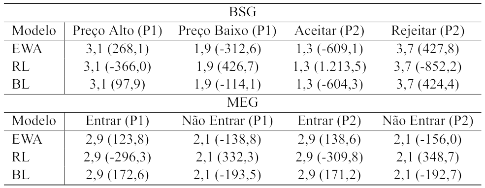
```

Frequências esperadas e resíduos padronizados do teste $\chi^2$ nos jogos BSG e MEG

:::

<p class="quarto-figure-attribution">Fonte: Elaborado pelo autor (2026).</p>


A Figura @fig-ch5-10 apresenta a distância média ao alvo teórico nos jogos BSG e MEG para os modelos EWA, RL e BL ao longo dos valores de $\lambda$. O eixo horizontal representa a sensibilidade do aprendizado. O eixo vertical mostra a distância média entre a proporção simulada e a probabilidade teórica definida para as estratégias de referência. No BSG, consideram-se “Rejeitar” para o Comprador e “Preço Alto” para o Vendedor. No MEG, a referência é “Entrar” para as duas empresas, com alvo teórico de $5/6$. A medida corresponde à diferença absoluta entre a proporção observada e o alvo teórico, $|p_t - p^*|$, resumida por jogo, modelo e valor de $\lambda$.

```{r}
#| label: code-distancia-alvo-teorico
#| echo: true
#| eval: false
#| code-fold: true
#| code-summary: "Mostrar código: cálculo da distância ao alvo teórico"

# Calcula as medidas de convergência de cada simulação
# em relação às probabilidades teóricas de referência.
sim_nomes <- paste0("sim", 1:10)

convergencias <- purrr::map2(
  plots[sim_nomes],
  lambda_values,
  sim_convergence
)

# Reúne as medidas-resumo das simulações.
conv_full <- purrr::map_dfr(
  convergencias,
  "summary"
)

# Calcula a distância média ao alvo por jogo,
# modelo de aprendizagem e valor de lambda.
conv_plot <- conv_full |>
  dplyr::group_by(
    jogo,
    type,
    lambda
  ) |>
  dplyr::summarise(
    erro_medio = mean(
      mean_error,
      na.rm = TRUE
    ),
    .groups = "drop"
  ) |>
  dplyr::mutate(
    type = factor(
      type,
      levels = c("EWA", "RL", "BL")
    ),
    jogo = factor(
      jogo,
      levels = c("BSG", "MEG")
    )
  )
```

No BSG, EWA e BL reduzem gradualmente a distância em relação ao alvo teórico conforme $\lambda$ aumenta. O RL, por sua vez, permanece mais afastado da referência. A trajetória das distâncias aponta que modelos com crenças, memória e avaliação ampliada da experiência captam melhor o aprendizado associado às estratégias esperadas do jogo. A aproximação ao alvo teórico, porém, não implica comportamento idêntico entre Comprador e Vendedor. O Comprador reage de forma mais direta à relação entre preço, valoração e aceitação da oferta. O Vendedor precisa antecipar a resposta do outro agente antes de definir o preço. Quando a aderência ao alvo teórico é tomada como critério, EWA e BL organizam melhor essas diferenças de papel em torno das estratégias de referência. O RL, restrito ao reforço dos resultados realizados, capta parte da adaptação, contudo se ajusta com menor precisão ao padrão teórico agregado.

No MEG, a distância ao alvo teórico varia sem seguir uma direção única. O BL apresenta a maior aderência relativa entre os três modelos. O EWA se aproxima da referência nos valores iniciais de $\lambda$, todavia volta a se afastar quando a sensibilidade às atrações aumenta. A inflexão observada relaciona-se com a estrutura do jogo. A decisão de entrar depende do ganho realizado em cada rodada, da expectativa sobre a ação concorrente e do risco de entrada simultânea. Como o alvo teórico corresponde a uma probabilidade mista, valores elevados de $\lambda$ podem tornar o aprendizado mais reativo às diferenças acumuladas nas trajetórias e menos próximo da randomização esperada. O BL preserva maior proximidade com a referência porque atualiza as escolhas a partir de crenças sobre o comportamento da outra empresa. O EWA também permanece relativamente próximo, pois combina reforço e avaliação de alternativas não escolhidas, embora responda com maior intensidade às atrações acumuladas quando $\lambda$ aumenta. O RL fica mais distante por se apoiar no *payoff* próprio observado, e consequentemente, com menor alcance para representar a antecipação estratégica exigida pela entrada em mercado.
```{r}
#| label: fig-ch5-10
#| fig-cap: 'Distância média ao alvo teórico por modelo de aprendizagem nos jogos BSG e MEG'
#| fig-align: center
#| out-width: "100%"
#| fig-cap-location: top

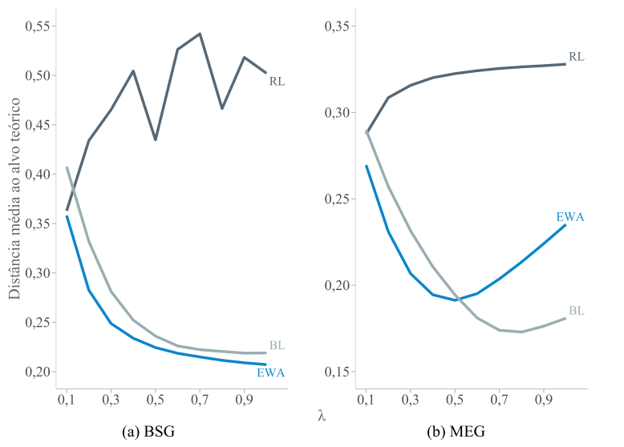
```

<p class="quarto-figure-attribution">Fonte: Elaborado pelo autor (2026).</p>

Embora este estudo não trate diretamente da formação de expectativas macroeconômicas, os resultados se aproximam da discussão de @dizioli2024adaptive, que estimam um modelo DSGE (*Dynamic Stochastic General Equilibrium*) com aprendizagem adaptativa para o Brasil entre 2000 e 2019. O parâmetro de aprendizado estimado para o Brasil foi de 0,78, acima do valor encontrado para os Estados Unidos, de 0,48. Para os autores, esse resultado aponta maior velocidade de aprendizado e maior dependência das expectativas brasileiras em relação aos resultados observados, de modo que choques inflacionários desfavoráveis tendem a deslocar as expectativas com mais intensidade e antecedência. Ainda que os modelos sejam distintos, essa implicação se aproxima dos achados deste trabalho. Regras de aprendizagem mais reativas podem responder rapidamente ao ambiente, mas também produzir menor aderência ao padrão teórico quando a atualização se apoia de forma excessiva nos resultados observados. No BSG, em que há ruído exógeno na valoração do bem, a distância do RL ao alvo teórico varia de forma mais irregular ao longo dos valores de $\lambda$ e se mantém acima das distâncias observadas em EWA e BL. O reforço puro capta parte da adaptação aos *payoffs* realizados, ainda assim tende a reagir de forma menos estável quando o ambiente combina flutuações externas e decisões interdependentes.

Um paralelo mais direto aparece em @hong2021learning, que analisam bolhas especulativas por meio de uma versão simplificada do EWA e distinguem o aprendizado por reforço, baseado nas ações escolhidas, do aprendizado baseado em crenças, associado à avaliação de ações não escolhidas. Os autores identificam o reforço como mecanismo predominante no experimento, embora ele não conduza necessariamente ao equilíbrio no curto prazo. Quando o jogo exige mais etapas de raciocínio, a experiência pode ampliar a especulação, já que os agentes passam a explorar erros esperados dos demais participantes. A diferença entre experiência realizada e avaliação estratégica ajuda a interpretar os resultados simulados deste trabalho. A experiência realizada gera adaptação, ainda que sua capacidade de aproximar os agentes do equilíbrio dependa da estrutura do jogo e do tipo de informação incorporado pela regra de aprendizagem.

A experiência recente ou realizada, nas expectativas macroeconômicas e nas interações estratégicas, pode gerar adaptação sem aderência plena ao padrão teórico. Nos resultados deste estudo, EWA e BL ficam mais próximos das estratégias associadas aos equilíbrios analisados porque incorporam memória, avaliação contrafactual e formação de crenças.