---
title: Resultados Complementares
---

A reprodutibilidade em 100 iterações mantém a predominância do equilíbrio de Nash [Preço Alto, Rejeitar] no BSG, registrado em 75 ocorrências ao longo da simulação. Nos outros 25 casos, a solução aparece associada simultaneamente aos equilíbrios [Preço Alto, Rejeitar] e [Preço Baixo, Rejeitar], mantendo a rejeição do comprador como traço comum entre os resultados. A alternância entre esses equilíbrios decorre da incerteza simétrica estocástica incorporada ao jogo. Nesse caso, a valoração $V$ do bem varia conforme o termo de ruído exógeno $\epsilon$, que representa flutuações de demanda, renda, preços, inflação ou outros choques externos ao ambiente de decisão. Mesmo com essa variação, as iterações permanecem concentradas em torno da estratégia de rejeição do comprador, como apresentado na Figura @fig-ap-18.

```{r}
#| label: fig-ap-18
#| fig-cap: 'Contagem acumulada das ocorrências dos equilíbrios (Preço Alto, Rejeitar) e (Preço Alto, Rejeitar), (Preço Baixo, Rejeitar) ao longo de 100 iterações do BSG'
#| fig-align: center
#| out-width: "100%"
#| fig-cap-location: top

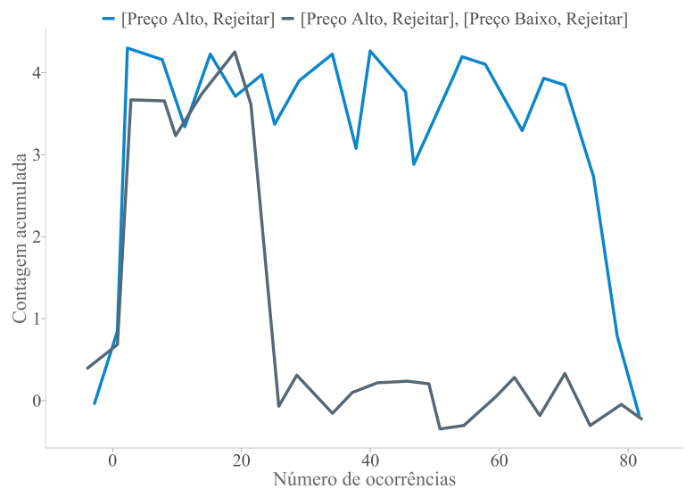
```

<p class="quarto-figure-attribution">Fonte: Elaborado pelo autor (2026).</p>

A distribuição percentual representada na Figura @fig-ap-19 torna mais visível o padrão apresentado na Tabela @tbl-ch5-9. No BSG, EWA e BL concentram maior participação em [Preço Alto], para o vendedor, e [Rejeitar], para o comprador. O RL segue outro desenho, com proporções mais distribuídas entre as quatro estratégias. No MEG, a composição aparece de forma mais simétrica entre as empresas. A estratégia [Entrar] tem maior peso relativo nos modelos EWA e BL, enquanto o RL se aproxima de uma divisão mais equilibrada entre Entrar e Não Entrar.

```{r}
#| label: fig-ap-19
#| fig-cap: 'Distribuição percentual agregada das estratégias nos jogos BSG e MEG segundo modelo de aprendizagem'
#| fig-align: center
#| out-width: "100%"
#| fig-cap-location: top

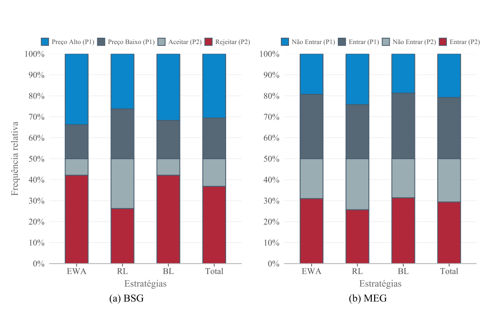
```

<p class="quarto-figure-attribution">Fonte: Elaborado pelo autor (2026).</p>

As Figuras @fig-ap-20 a @fig-ap-24 apresentam as variações complementares das proporções médias de escolha para valores intermediários de $\lambda$, especificamente $\lambda = 0{,}2$, $\lambda = 0{,}4$, $\lambda = 0{,}6$, $\lambda = 0{,}7$ e $\lambda = 0{,}9$. Os gráficos mantêm a mesma organização das figuras discutidas no capítulo de resultados, reunindo as trajetórias dos modelos EWA, RL e BL nos jogos BSG e MEG. No BSG, o padrão observado na análise principal permanece visível. EWA e BL concentram as escolhas com maior força em Rejeitar, para o comprador, e Preço Alto, para o vendedor, enquanto o RL se mantém mais próximo de uma distribuição equilibrada entre as alternativas. No MEG, EWA e BL preservam maior frequência da estratégia Entrar para ambas as empresas. O RL, por sua vez, apresenta maior oscilação e proporções mais próximas entre Entrar e Não Entrar.

```{r}
#| label: fig-ap-20
#| fig-cap: 'Proporções de escolha das estratégias ao longo do tempo no BSG e no MEG para $\lambda = 0{,}2$'
#| fig-align: center
#| out-width: "100%"
#| fig-cap-location: top

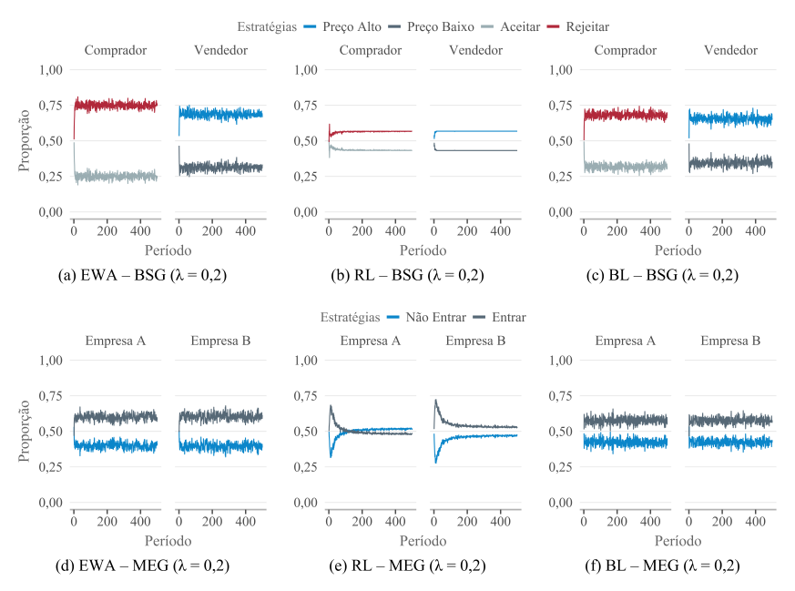
```

<p class="quarto-figure-attribution">Fonte: Elaborado pelo autor (2026).</p>

```{r}
#| label: fig-ap-21
#| fig-cap: 'Proporções de escolha das estratégias ao longo do tempo no BSG e no MEG para $\lambda = 0{,}4$'
#| fig-align: center
#| out-width: "100%"
#| fig-cap-location: top

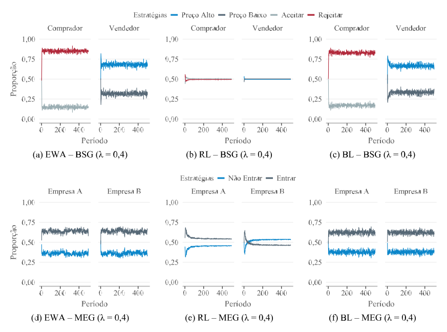
```

<p class="quarto-figure-attribution">Fonte: Elaborado pelo autor (2026).</p>

```{r}
#| label: fig-ap-22
#| fig-cap: 'Proporções de escolha das estratégias ao longo do tempo no BSG e no MEG para $\lambda = 0{,}6$'
#| fig-align: center
#| out-width: "100%"
#| fig-cap-location: top

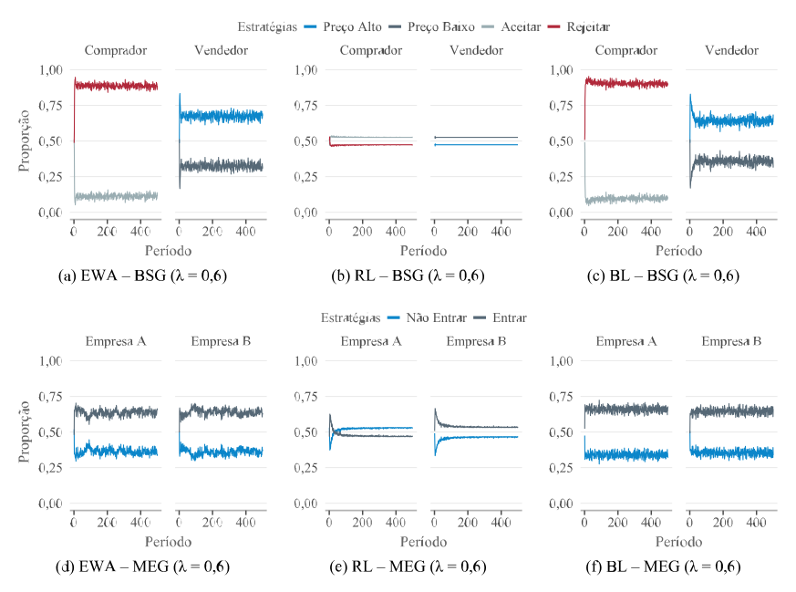
```

<p class="quarto-figure-attribution">Fonte: Elaborado pelo autor (2026).</p>

```{r}
#| label: fig-ap-23
#| fig-cap: 'Proporções de escolha das estratégias ao longo do tempo no BSG e no MEG para $\lambda = 0{,}7$'
#| fig-align: center
#| out-width: "100%"
#| fig-cap-location: top

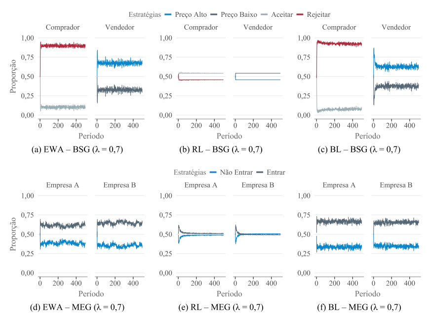
```

<p class="quarto-figure-attribution">Fonte: Elaborado pelo autor (2026).</p>

```{r}
#| label: fig-ap-24
#| fig-cap: 'Proporções de escolha das estratégias ao longo do tempo no BSG e no MEG para $\lambda = 0{,}9$'
#| fig-align: center
#| out-width: "100%"
#| fig-cap-location: top

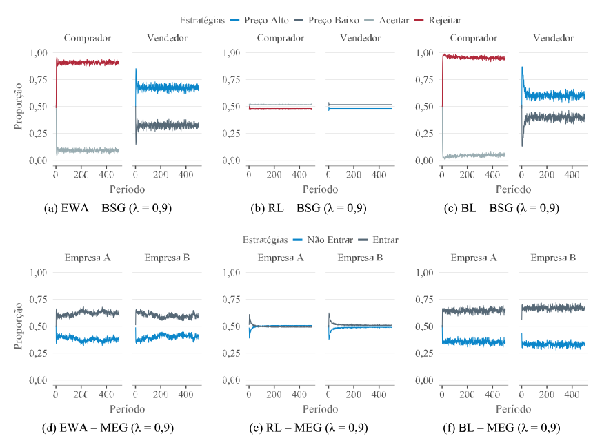
```

<p class="quarto-figure-attribution">Fonte: Elaborado pelo autor (2026).</p>

As Tabelas @tbl-ap-11 a @tbl-ap-14 apresentam a análise de sensibilidade do critério de estabilidade para diferentes valores de $\varepsilon$, mantendo constantes os demais parâmetros da janela móvel. Com limiares menores, como $\varepsilon = 0{,}01$ e $\varepsilon = 0{,}02$, a classificação se torna mais exigente, pois a variação permitida entre períodos consecutivos é bastante reduzida. Nesses casos, várias combinações de jogo, modelo, jogador e $\lambda$ não atingem a condição mínima de estabilidade ao longo das simulações e aparecem nas tabelas como “--”. À medida que $\varepsilon$ aumenta, o critério passa a aceitar oscilações maiores entre períodos consecutivos. Em $\varepsilon = 0{,}04$ e $\varepsilon = 0{,}05$, a estabilidade é reconhecida em praticamente todas as combinações, com taxas muitas vezes próximas ou iguais a 100%. A adoção de $\varepsilon = 0{,}03$ ocupa uma posição intermediária nessa escala. O limiar permite identificar trajetórias estabilizadas sem restringir a classificação a poucos casos isolados e sem considerar estável quase toda variação pequena observada nas simulações.

::: {#tbl-ap-11}

```{r}
#| echo: false
#| fig-align: center
#| out-width: "100%"

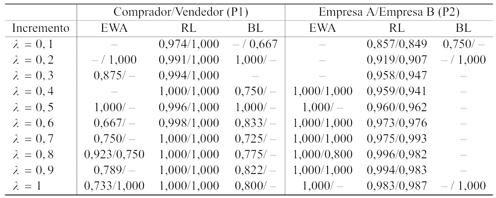
```

Análise de sensibilidade do critério de estabilidade para $\varepsilon = 0{,}01$

:::

<p class="quarto-figure-attribution">Nota: O símbolo ``--'' indica valor ausente. Fonte: Elaborado pelo autor (2026).</p>

::: {#tbl-ap-12}

```{r}
#| echo: false
#| fig-align: center
#| out-width: "100%"

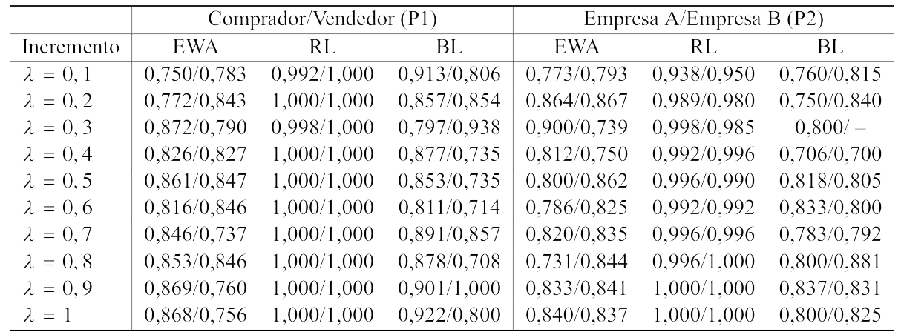
```

Análise de sensibilidade do critério de estabilidade para $\varepsilon = 0{,}02$

:::

<p class="quarto-figure-attribution">Fonte: Elaborado pelo autor (2026).</p>

::: {#tbl-ap-13}

```{r}
#| echo: false
#| fig-align: center
#| out-width: "100%"

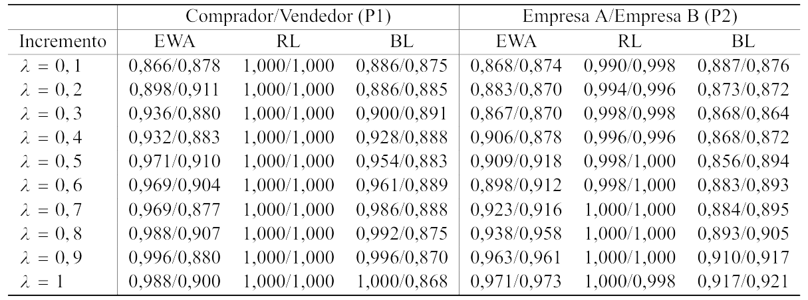
```

Análise de sensibilidade do critério de estabilidade para $\varepsilon = 0{,}04$

:::

<p class="quarto-figure-attribution">Fonte: Elaborado pelo autor (2026).</p>

::: {#tbl-ap-14}

```{r}
#| echo: false
#| fig-align: center
#| out-width: "100%"

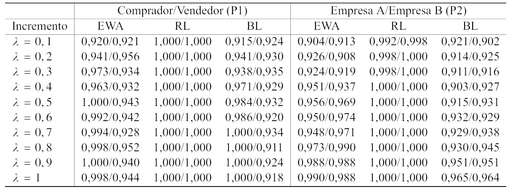
```

Análise de sensibilidade do critério de estabilidade para $\varepsilon = 0{,}05$

:::

<p class="quarto-figure-attribution">Fonte: Elaborado pelo autor (2026).</p>
